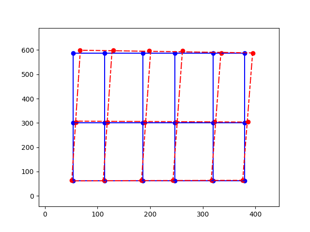
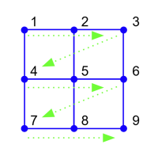

# 2D Calibration

When programming a 2D Cartesian gantry or or XY system, it is often necessary to calibrate the stages for orthogonality, distortion, and stretch of each axis to achieve the accuracy required. The end goal is to be able to commanding the stage to go to a particular coordinate, and have the stage be on target.

This is a Python example showing how to take the expected and actual coordinates of a few grid
points, and generate a mapping from desired coordinates to calibrated coordinates.

|         Basic Bilinear           |            Biquadratic              |             Real Example              |
|:--------------------------------:|:-----------------------------------:|:-------------------------------------:|
|  |  |  |

This calibration algorithm requires as input both the coordinates of the **expected** positions (blue dots), and the coordinates of the **actual** positions (red dots). The actual positions can be acquired by moving the gantry until the end effector is directly on the fiducial mark or sample, and then reading off the positions from software such as [Zaber Launcher](https://software.zaber.com/zaber-launcher/download).

- On the left is the most basic bilinear interpolation, requiring four corner point pairs - expected coordinates $(x_p, y_p)$ and actual coordinates $(x_p', y_p')$. The calibration algorithm uses these point pairs to generate the coefficients for a mapping function that the user can call to transform desired coordinates to calibrated coordinates from any location.

- The calibration code is flexible enough that it can take an arbitrary number of points and do a least-square fit to an arbitrary order of polynomial in either axis.  In the middle example, we generated points with a random offset, and fitted a 2nd order (quadratic) curve to both axis.  A quadratic curve requires a minimum of 3 points to define the function, and two-dimensional biquadratic fit requires a minimum of 3 x 3 = 9 points.  In the middle picture we supplied 5 x 5 = 25 points, so the calibration code does a least-square fit to minimize the error.

- On the right is data from a real-life example of actual measured error in a gantry system, and using the calibration code to do a linear fit (bilinear) in both axis.

## Hardware Requirements

There are two scripts included in this example: A non-interactive math demo, and an interactive demo that works with Zaber stages.

There is no hardware requirement for the non-interactive example script, as it only demonstrates the algorithm
and visualizes the results in a plot.  However, the algorithm can be adapted to be used with any
Cartesian gantry or X-Y system, such as
[Zaber Technologies Gantry Systems](https://www.zaber.com/products/xy-xyz-gantry-stages)

For the interactive demo, you will need two Zaber linear stages. This can be either two peripherals connected to a controller,
or two separate integrated devices connected in a daisy chain to the same serial port. You will need a way to move the devices
while the script is running - either by turning the knobs, or by starting Zaber Launcher before the script so it can share
the connection.

## Dependencies / Software Requirements / Prerequisites

The script uses `pipenv` to manage virtual environment and dependencies:

```shell
python3 -m pip install -U pipenv
```

The dependencies are listed in Pipfile.

## Running the Script

To run the math-only script:

```shell
cd examples/calibration_2d
pipenv install
pipenv run python calibrate.py
pipenv run python calibrate.py basic
```

To run the interactive script (assuming COM1 is the serial port your devices are connected to):

```shell
cd examples/calibration_2d
pipenv install
pipenv run python interactive.py COM1
```

## How it works

### Non-Interactive Script

The non-interactive script consists of the following files:

- `calibrate.py` - a script to be called on the command line, to generate random points
and demonstrates how `Calibration` class works by plotting the coordinates before and after mapping
- `calibration.py` - contains `Calibration` class, which can be used in other programs and applications

When running `calibrate.py`, you can specify the type of interpolation to plot with the script:

| Interpolation | Order | Minimum Number of Points |
|:-------------:|:-----:|:------------------------:|
|    `basic`    |  1st  |        2 x 2 = 4         |
|  `bilinear`   |  1st  |        2 x 2 = 4         |
| `biquadratic` |  2nd  |        3 x 3 = 9         |
|   `bicubic`   |  3rd  |        4 x 4 = 16        |
|    `poly`     | m x n |    (m + 1) x (n + 1)     |

The higher order the interpolation, the more initial data points
are necessary to deterministically generate the calibration map.
`basic` demonstrates a simple bilinear interpolation with no optional parameters.
By default, `bilinear`, `biquadratic`, and `bicubic` interpolation randomly generates
the minimum number of points required to fit the interpolation chosen.
The number of randomly generated points can be overridden with
the optional parameter `[<points>]` on the command line.  For example:

```shell
pipenv run python calibrate.py bilinear 5
```

This generates a 5 x 5 = 25 points grid and does a bilinear least-square fit.

When the minimum (order + 1)<sup>2</sup> number of points is used, the interpolated grid passes
through all the points.  When more than the minimum number of points is supplied, the interpolated
grid is computed based on least-square best fit.  When less than the minimum number of points is
supplied, the algorithm does not have enough information to generate a deterministic solution.

The `poly` interpolation can be specified with any order of polynomial and any number of points,
independently for the x-axis and y-axis.

For example:

```shell
pipenv run python calibrate.py poly 1 2 4 3
```

This generates a 4 x 3 = 12 pairs of expected and actual points,
and tries to do an order 1 (linear) fit for the x-axis and order 2 (quadratic) fit for the y-axis.

To see the arguments for each of the functions, run:

```shell
pipenv run python calibrate.py -h
```

For a more detailed explanation of the math behind the algorithm,
please see [calibration_map.md](calibration_map.md).


### Interactive Script

The interactive script `interactive.py` uses functions found in the other files and in the
[Zaber Motion Library](https://software.zaber.com/motion-library/docs) to demonstrate how you
can collect data to calculate a calibration matrix and then use the calibration to make the
stages move to corrected positions.

To use this example effectively, we recommend you set up your Zaber stages in an X-Y configuration
with some way to measure or visually register their positions in the real world - for a simple example,
attach a pen or wire to the carriage, pointing at a fixed piece of graph paper.

When you run the example script, it will list detected linear stages and ask you to select two
to be the X and Y axes for the demo.

Then, it will ask you to move the stages to sample points and enter the expected coordinates of those points.
You must enter a square grid of 4, 9, 16 or 25 sample points; the script chooses the interpolation method based
on the number of points.

To enter a data point, use the knobs on the devices or Zaber Launcher's Basic Movement or Terminal apps to
move the devices until your measurement indicator shows the desired position, then press Enter in the script
window and type in what the coordinates of that location should be. Then repeat for subsequent points.

For this simple example, it's important to enter a square grid of points in raster scan order as shown below.



After you're done entering points, enter a blank line to end this phase. The script will then display a plot
of expected versus actual device coordinates, similar to the non-interactive example. Close the plot window
to continue.

In the final phase of the example, it will ask you to type in coordinate pairs. Type in the coordinates you expect
the device to move to in order to correspond with the measurements you've made. The script will apply the calculated
calibration to move the devices to positions that most closely match your measurements. Enter a blank line to
end the example.
