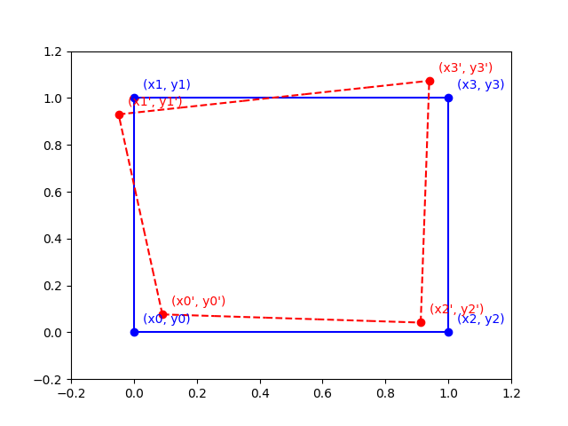

# Calibration Mapping Algorithm

This article explores the math behind the example code for 2D Calibration.

## Basic Bilinear Interpolation

In the following diagram, the x and y axes are the hardware controller's coordinate system.

The most basic calibration assumes that we can measure the error at the four corners of the working area, and that the deviation from ideal varies linearly from one corner to the next. This is a [Bilinear Interpolation](https://en.wikipedia.org/wiki/Bilinear_interpolation), applied twice - once to compute the calibrated $x'$, and once to compute the calibrated $y'$:

$$
    x' = a_{00} + a_{10}x + a_{01}y + a_{11}xy
$$

$$
    y' = b_{00} + b_{10}x + b_{01}y + b_{11}xy
$$

In the above equations:

- $(x,y)$ is the **expected** position that the user can theoretically expect to find the ficudial mark or the sample.
- $(x',y')$ is the **actual** position that the user actually has to send as a command to the machine in order to hit the fiducial mark or sample.
- $a_{ij}$ and $b_{ij}$ are the unknown constants for computing $x'$ and $y'$, where $i$ is the order of $x$ and $j$ is the order of $y$.

In a bilinear interpolation, where both $i$ and $j$ ranges from 0 to 1, there are 4 constants per equation for a total of 8 unknowns, which means we need 8 data points to solve for all the unknowns.

Referring to the same figure in Introduction where we have $(x_p,y_p)$ where $p$ is from 0 to 3, we get our 8 equations from the four pairs of expected and actual points to solve for our 8 unknowns.  If we group the 8 equations by axis and write them out in matrix form we have:

$$
    \begin{bmatrix}
        x_0'\\
        x_1'\\
        x_2'\\
        x_3'
    \end{bmatrix}
    =
    \begin{bmatrix}
        1 & x_0 & y_0 & x_0y_0\\
        1 & x_1 & y_1 & x_1y_1\\
        1 & x_2 & y_2 & x_2y_2\\
        1 & x_3 & y_3 & x_3y_3
    \end{bmatrix}
    \begin{bmatrix}
        a_{00}\\
        a_{10}\\
        a_{01}\\
        a_{11}
    \end{bmatrix}
$$

$$
    \mathbf{x = M a}
$$

$$
    \begin{bmatrix}
        y_0'\\
        y_1'\\
        y_2'\\
        y_3'
    \end{bmatrix}
    =
    \begin{bmatrix}
        1 & x_0 & y_0 & x_0y_0\\
        1 & x_1 & y_1 & x_1y_1\\
        1 & x_2 & y_2 & x_2y_2\\
        1 & x_3 & y_3 & x_3y_3
    \end{bmatrix}
    \begin{bmatrix}
        b_{00}\\
        b_{10}\\
        b_{01}\\
        b_{11}
    \end{bmatrix}
$$

$$
    \mathbf{y = M b}
$$

We can solve for the coefficients by multiplying the inverse on both sides:

$$
    \mathbf{M^{-1}x = M^{-1}Ma}
$$

$$
    \mathbf{a = M^{-1}x}
$$

$$
    \mathbf{M^{-1}x = M^{-1}Mb}
$$

$$
    \mathbf{b = M^{-1}x}
$$

Then we can plug the newly computed coefficients $a_{ij}$ and $b_{ij}$ back in the original formula to compute $(x',y')$ from any $(x,y)$:

$$
    x' = a_{00} + a_{10}x + a_{01}y + a_{11}xy
$$

$$
    y' = b_{00} + b_{10}x + b_{01}y + b_{11}xy
$$

## Least Square Fit

The above example works well if we have exactly 4 points to do a bilinear interpolation.  If we have more than 4 points, then we would want to find the best-fit using a least-square fit.  Here is an example of what a bilinear interpolation using least-square fit looks like with 4 x 4 = 16 points:

To solve for the least square, we extending the basic example above to have $p$ points:

$$
    \begin{bmatrix}
        x_0'\\
        x_1'\\
        \vdots\\
        x_p'
    \end{bmatrix}
    =
    \begin{bmatrix}
        1 & x_0 & y_0 & x_0y_0\\
        1 & x_1 & y_1 & x_1y_1\\
        \vdots & \vdots & \vdots & \vdots\\
        1 & x_p & y_p & x_py_p
    \end{bmatrix}
    \begin{bmatrix}
        a_{00}\\
        a_{10}\\
        a_{01}\\
        a_{11}
    \end{bmatrix}
$$

$$
    \mathbf{x = Ma}
$$

$$
    \begin{bmatrix}
        y_0'\\
        y_1'\\
        \vdots\\
        y_p'
    \end{bmatrix}
    =
    \begin{bmatrix}
        1 & x_0 & y_0 & x_0y_0\\
        1 & x_1 & y_1 & x_1y_1\\
        \vdots & \vdots & \vdots & \vdots\\
        1 & x_p & y_p & x_py_p
    \end{bmatrix}
    \begin{bmatrix}
        b_{00}\\
        b_{10}\\
        b_{01}\\
        b_{11}
    \end{bmatrix}
$$

$$
    \mathbf{y = Mb}
$$

Now the system is over-determined, the formula to calculate the coefficients for a least-square best-fit is to use the left [pseudoinverse](https://en.wikipedia.org/wiki/Moore%E2%80%93Penrose_inverse):

$$
    \mathbf{M^+ = (M^T M)^{-1}M^T}
$$

Applying it to the equations above:

$$
    \mathbf{M^+ x = M^+ M a}
$$

$$
    \mathbf{a = M^+ x}
$$

$$
    \mathbf{M^+ x = M^+ M b}
$$

$$
    \mathbf{b = M^+ y}
$$

Therefore to solve for the two sets of coefficients:

$$
    \mathbf{a = (M^T M)^{-1}M^T x}
$$

$$
    \mathbf{b = (M^T M)^{-1}M^T y}
$$

This general formula for finding least-square works well even for the original case where we have exactly the minimum number of points to fully determine the system; therefore we only use this formula in the example code rather than the simpler inverse of the matrix.

## Higher Order Interpolations

Sometimes a curve fits better than a straight line.  The calibration algorithm can be easily adapted to fit to a polynomial of $n^{th}$ order. The following example uses a $2^{nd}$ order biquadratic least-square fit for both the x-axis and y-axis.

For n=2, the equations for Biquadratic Interpolation becomes:

$$
    x' = a_{00} + a_{10}x + a_{20}x^2
    + a_{01}y + a_{11}xy + a_{21}x^2y
    + a_{02}y^2 + a_{12}xy^2 + a_{22}x^2y^2
$$

$$
    y' = b_{00} + b_{10}x + b_{20}x^2
    + b_{01}y + b_{11}xy + b_{21}x^2y
    + b_{02}y^2 + b_{12}xy^2 + b_{22}x^2y^2
$$

Taking the $x'$ equation as an example ($y'$ equation is similar, except replacing $a$'s with $b$'s), another way to write this in matrix form is:

$$
    x' =
    \begin{bmatrix}
        1 & x & x^2
    \end{bmatrix}
    \begin{bmatrix}
        a_{00} & a_{01} & a_{02}\\
        a_{10} & a_{11} & a_{12}\\
        a_{20} & a_{21} & a_{22}
    \end{bmatrix}
    \begin{bmatrix}
        1\\
        y\\
        y^2
    \end{bmatrix}
$$

This equation has 9 unknown coefficients, requiring a minimum of 9 points to fully solve.  Expanding the formula needed to solve for the 9 coefficients:

$$
    \begin{bmatrix}
        x_0'\\
        x_1'\\
        \vdots\\
        x_p'
    \end{bmatrix}
    =
    \begin{bmatrix}
        1 & x_0 & x_0^2 & y_0 & x_0y_0 & x_0^2y_0 & y_0^2 & x_0y_0^2 & x_0^2y_0^2\\
        1 & x_1 & x_1^2 & y_1 & x_1y_1 & x_1^2y_1 & y_1^2 & x_1y_1^2 & x_1^2y_1^2\\
        \vdots & \vdots & \vdots & \vdots & \vdots & \vdots & \vdots & \vdots & \vdots\\
        1 & x_p & x_p^2 & y_p & x_py_p & x_p^2y_p & y_p^2 & x_py_p^2 & x_p^2y_p^2\\
    \end{bmatrix}
    \begin{bmatrix}
        a_{00}\\
        a_{10}\\
        a_{20}\\
        a_{01}\\
        a_{11}\\
        a_{21}\\
        a_{02}\\
        a_{12}\\
        a_{22}
    \end{bmatrix}
$$

In other words, we have the following (asssume we do the same for $y'$):

$$
    \mathbf{x = Ma}
$$

$$
    \mathbf{y = Mb}
$$

To solve for the coefficients, apply the same least-square technique:

$$
    \mathbf{a = (M^T M)^{-1}M^T x}
$$

$$
    \mathbf{b = (M^T M)^{-1}M^T y}
$$

The above technique can be applied to any higher order polynomial interpolation.  The algorithm in [calibration.py](calibration.py) is written to handle any order of interpolation from bilinear (n=1) and up.

It is also possible to use a different order for each axis.  The following example uses a linear least-square fit along the x-axis, and a cubic fit along the y-axis:

The above graph is generated by the command:

    pipenv run python calibrate.py poly 1 3 5 4

## Tiling

Instead of using higher order interpolation, it is possible to break the grid down into tiles having 4 corner points each, and use the basic linear interpolation to map from theoretical location to calibrated coordinates.  Please [contact Zaber Technologies](https://www.zaber.com/contact) if you are interested in seeing an example of this implementation.
