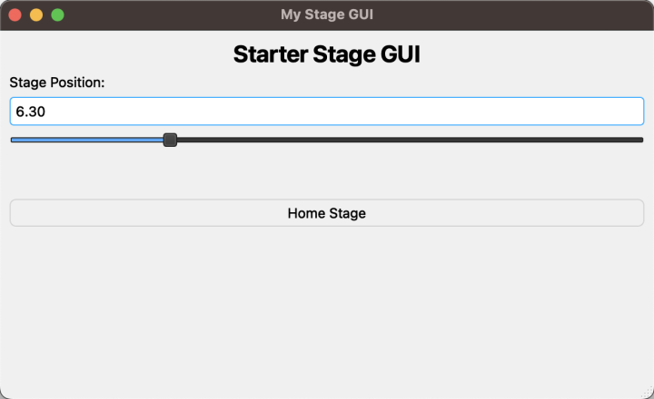

# GUI PyQt6

*By Nathan Paolini*

This basic GUI allows the user to control and monitor stage position



## Dependencies / Software Requirements / Prerequisites

The script uses `pdm` to manage virtual environment and dependencies:

Instructions on how to install it can be found on the official `pdm` project page [here](https://github.com/pdm-project/pdm).

The dependencies are listed in `pyproject.toml`.

## Configuration

Edit the following constants in the script to fit your setup before running the script:

- `SERIAL_PORT`: the serial port that your device is connected to.
For more information on how to identify the serial port,
see [Find the right serial port name](https://software.zaber.com/motion-library/docs/guides/communication/find_right_port).
- `AXIS_NUM`: the axis number of your stage.

## Running the Script

Connect a stage first.

### Running the Script

Once everything has been configured, you can run the example:

```shell
cd examples/gui_pyqt6/
pdm install
pdm run example
```

## Editing the GUI

The GUI can be editted using QT Designer, which is included with the PyQt6-tools package.

To launch QT Designer, which can be used to modify the `ui_raw.ui` file, run this command:

Windows:

```shell
.venv\Scripts\pyqt6-tools.exe designer
```

Linux/MacOS:

```shell
.venv/bin/pyqt6-tools designer
```

After modifying the `ui_raw.ui` file, the first time the GUI is run the `ui_raw.ui` file will
be compared to the `ui_raw_compare.ui` file, the script will see differences, and it will then
generate a new `ui.py` file by running `UI_py_convert.bat` (this process will need modifications for Linux/Mac).
The benefit of this setup compared to just using the `ui_raw.ui` file directly is that the generated `ui.py` file
provides correct type hints for PyQt objects.

## Script Purpose

This script launches a GUI that provides live output of a stage's position and allow the user to move the stage.
This is meant to be a starter GUI that functionality can be added to.
