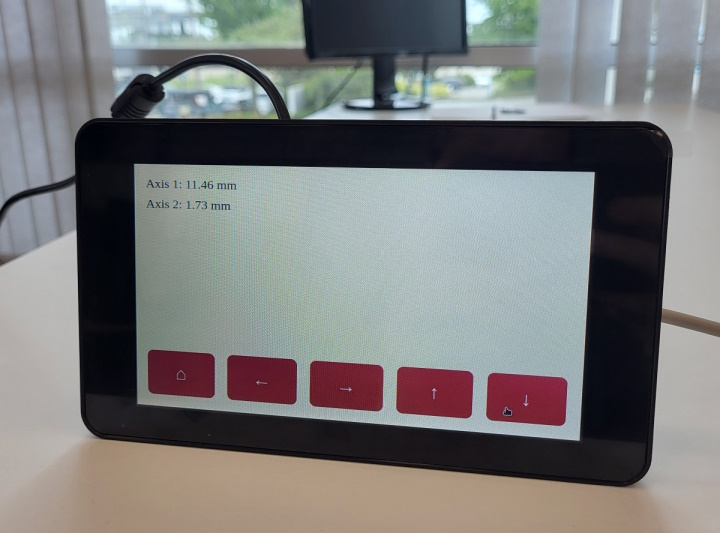

# Raspberry PI Touch Screen Device Control



The example demonstrates a simple user interface for Raspberry PI with a touch screen that controls a Zaber device.

The application consists of two parts: A web server written in Python using Flask library (`main.py`)
and a single HTML/CSS/JavaScript webpage (`index.html`).

## Requirements

The example is intended for Raspberry PI with the original 7-inch touchscreen but likely works on any computer,
regardless of the operating system or hardware.

The application expects a single 2-axis controller with linear peripherals.
You can modify the code if you have a different setup (e.g. an integrated single-axis device).

To run the server, you'll need Python 3.9 (the default at the time of writing) and [pipenv](https://pipenv.pypa.io/en/latest/installation/).
You can remove the Python version requirement from `Pipfile` if you want to use a different Python version.

## Running

Before running for the first time, install the required packages:

```shell
python3 -m pipenv install
```

Then, open a terminal and start the server.
Set the `PORT` environment variable to your serial port or change the default in `main.py`.

```shell
export PORT=/dev/ttyUSB0
python3 -m pipenv run python main.py
```

Then open a web browser and navigate to `http://localhost:8080`. Alternatively, you can use the following command:

```bash
chromium-browser --app=http://localhost:8080
```

Home your axes and start moving.

## Development

We designed the example to allow for easy modifications.
You can copy and paste functions in `main.py` and buttons in `index.html` to add new functionalities.
For example, add a button that moves one axis by 1 mm:

```py
@app.post("/move-1mm")
def move_1mm() -> flask.ResponseReturnValue:
    """Move by 1 mm."""
    device.get_axis(HORIZONTAL_AXIS).move_relative(1, "mm")
    return ("", 204)
```

```html
<button onpointerdown="action('move-1mm')">Move 1 mm</button>
```

Remember to restart the server and reload the page to apply your changes.

## Extra: Add to the menu

You may find it helpful to start your application from the Raspbian menu using just the touch screen.
To enable that, create two files in the `~/.local/share/applications/` directory called `move_client.desktop`
and `move_server.desktop`.

Add the following content to `move_client.desktop`:

```ini
[Desktop Entry]
Encoding=UTF-8
Version=1.0
Type=Application
Terminal=false
Exec=/usr/bin/chromium-browser --app=http://localhost:8080 --start-fullscreen
Name=Move Client
```

And add this content to `move_server.desktop`.
You must change the `Path=/home/zaber/code/gui_raspberrypi_touch` line to your directory.

```ini
[Desktop Entry]
Encoding=UTF-8
Version=1.0
Type=Application
Terminal=true
Exec=python3 -m pipenv run python main.py
Path=/home/zaber/code/gui_raspberrypi_touch
Name=Move Server
```

Now, you can find your applications under the *Other* directory in Raspbian's menu.
