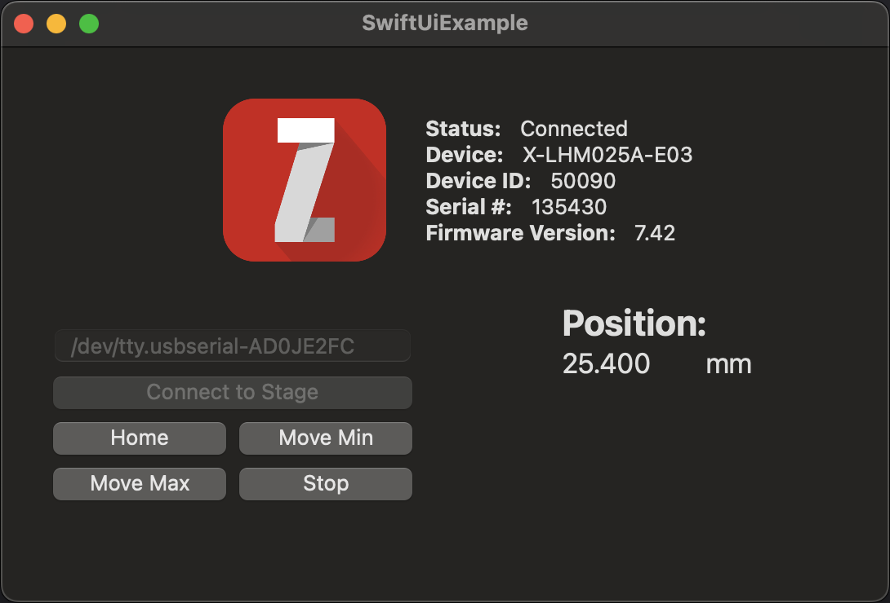

# Simple GUI using SwiftUI

This example demonstrates using the [SwiftUI Framework](https://developer.apple.com/xcode/swiftui/)
to create a simple Interface to control a Zaber device.

## Hardware Requirements

Any Zaber linear motion device connected to a serial port.

## Dependencies / Software Requirements / Prerequisites

XCode 16+
MacOS 14.5+

## Configuration / Parameters

The serial port to connect to can be entered into the input box after script startup.

Optinally, you can edit the following constants in the script before running the script:

- `DeviceConstants.deviceAddress`: The device address of the device you'd like to connect to
- `DeviceConstants.axisNumber`: The axis number of the axis you'd like to control on the device (`1` for most integrated devices)

## Running the Script

To run the script, open the project in XCode and press the `Start` button.
