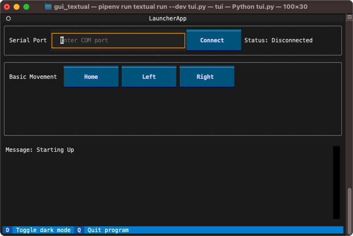

# Simple Text-based GUI (TUI) using Textual

This example demonstrates using the Python package [Textual](https://textual.textualize.io/)
to create a simple Text Based Interface to control Zaber devices.



## Hardware Requirements

Any Zaber linear motion device connected to a serial port.

## Dependencies / Software Requirements / Prerequisites

The script uses `pipenv` to manage virtual environment and dependencies.

Windows:

```shell
py -m pip install --user --upgrade pipenv
```

Linux / MacOS:

```shell
python3 -m pip install --user --upgrade pipenv
```

For full installation instruction, including making sure that 'pipenv' is available
in your path after installation,
please refer to the official documentation on [Installing Pipenv](https://pipenv.pypa.io/en/latest/installation/).

Note: if `pipenv` is not in your path after installtion,
you can still call it by

- `py -m pipenv` (Windows)
- `python3 -m pipenv` (Linux / MacOS)

The dependencies are listed in [`Pipfile`](Pipfile).

## Configuration / Parameters

The serial port to connect to can be entered into the input box after script startup.

Optinally, you can edit the following constants in the script before running the script:

- `SERIAL_PORT`: the serial port that your device is connected to.
For more information on how to identify the serial port,
see [Find the right serial port name](https://software.zaber.com/motion-library/docs/guides/find_right_port).

## Running the Script

To run the script, make sure you are running in a stand-alone terminal instead of in the terminal of your IDE.

    cd src/gui_textual
    pipenv install
    pipenv run python tui.py

## Text-based User Interface

A Text-based User Interface (TUI) is similar to a Graphical User Interface (GUI), except that
the elements are rendered using ASCII text directly in the terminal.
[Textual](https://textual.textualize.io/) is a Python package that provides a
*Rapid Application Development* framework that enables a very simple example that is a step up
from Command Line Interface (CLI).
