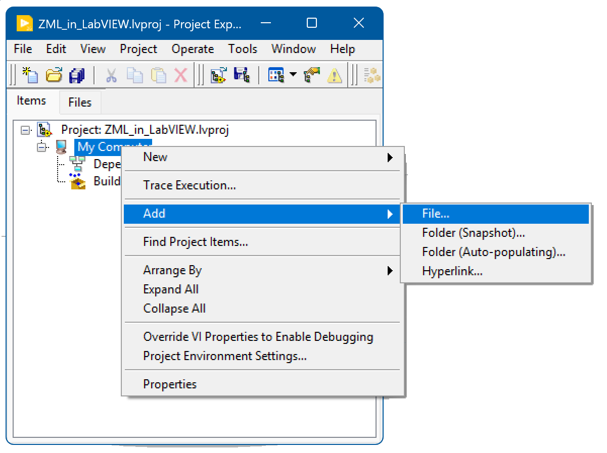
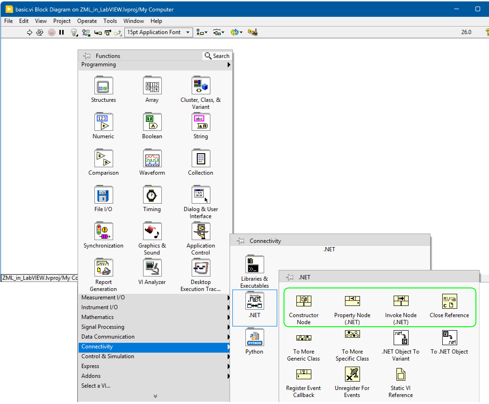
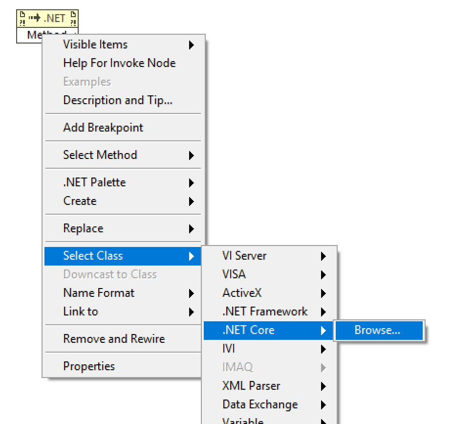
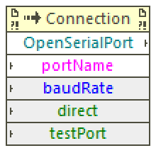

# Calling the Zaber Motion Library from LabVIEW

*By Soleil Lapierre*

It's possible to call the Zaber Motion Library's functions from LabVIEW by using LabVIEW's
support for .NET libraries.

The advantage of this approach is that you can make use of the huge range of functionality that the Zaber
Motion Library provides, with minimal extra implementation within LabVIEW.

The downsides are that initial setup of your LabVIEW project is a little technical, and updating to a new
version of the Zaber Motion Library can also be a bit of extra work.

This article provides both a working example project to refer to, and instructions on how to set up
a new LabVIEW project to work with the Zaber Motion Library.

## Hardware Requirements

To try out this example you will need at least one Zaber stage available to connect to via USB or RS-232.
The stage must be linear with a travel length greater than 1cm.

## Software Requirements

This example will only work correctly with LabVIEW 2026 Q1 (64-bit) or later.

This example is specific to Windows only. While it may be possible to make something similar work on
other platforms supported by LabVIEW, we have not tested it.

## The Example Project

In `labview/zaber.lvproj` you will find a working example project created in LabVIEW 2026 Q1 (64-bit). This project
contains one example VI: `basic.vi` is a minimal example showing how to open a connection, get references to Zaber
device and axis objects, invoke its methods, and dispose of resources. This one will only work with RS-232 or USB
device connections on your local computer.

## How it Works

LabVIEW has the ability to call functions in external libraries written in C, C# or Python using special node
types called Invoke nodes. Of the programming languages supported by both LabVIEW and the Zaber Motion Library,
C# is the most convenient one to use.

The general pattern is that you create an Invoke node with a reference to the Zaber Motion Library C# DLL to
call either an object constructor or a static method that returns an object, then use other Invoke nodes to call
methods on that object, or Property nodes to read or write properties.

Some Zaber Motion Library classes hold references to system resources. Most of the time you can leave disposing
of objects to LabVIEW and C#'s respective memory management systems, but you can optionally call the Dispose
methods on the objects and use the LabVIEW Close Reference node to free up its memory, if you are sure you
know when it is safe to do so. Use with caution.

## Creating Your Own Project

To create a LabVIEW project that calls C# code, you must obtain the C# DLL that contains the functions you want
to use, and all of its dependency DLLs. Then you can create a LabVIEW project file or VI and create Invoke
nodes that call the C# functions.

### Obtaining the DLLs

First, create a directory on disk for your LabVIEW project and create a subdirectory to put the DLLs in.
You should put the DLLs in a subdirectory of the project directory so that LabVIEW can consistently find
them using reference paths relative to the project file. For this example we'll use `dlls` as the subdirectory name.

The next step is to obtain the DLLs for the Zaber Motion Library and all its dependencies. Create and navigate to
a temporary directory anywhere on disk. This should not be inside your LabVIEW project directory, unless you 
remember to delete it when finished.

You can use [nuget.exe](https://www.nuget.org/downloads) to obtain the packages. Once you have NuGet downloaded
and available to run, open a command shell in your temporary directory and enter:

    nuget install zaber.motion

This will download the required packages from the NuGet Gallery.

When the NuGet command is complete, use Windows Explorer or your favorite file copying tool to copy DLLs from
all the packages in the temporary directory to the `dlls` directory you made under your LabVIEW project.
Look in the `lib` directory of each package. You may find multiple subdirectories for each supported framework
version; don't copy from all of them! Prefer to copy from the highest-numbered `net#.#` directory that
is supported by LabVIEW (note NOT `net##` without the dot, as those are for the old .NET Framework).
If there isn't a `net#.#` directory, use the highest-numbered `netstandard#.#` one.

From the Zaber Motion Library package specifically, you will also need to copy the DLLs from the
`runtimes/win/native` subdirectory of the package. You only need the one that is specific to your computer's
CPU architecture, but it is safe to copy them all.

### Invoking C# Functions

Setting up a LabVIEW project is outside the scope of this article but is not difficult; refer to the LabVIEW
documentation to get started.

An important first step is to add references to all the DLLs to your project file. In the project window, select
the Items tab, then right-click on My Computer and select Add -> File... from the menu. Browser to your `dlls`
directory and select all of the DLL files you copied above.

If you intend to build an executable from your LabVIEW project, you should also add the same DLLs to the executable's build
files property as shown in [this NI Knowledge Base article](https://knowledge.ni.com/KnowledgeArticleDetails?id=kA00Z000000kKgsSAE&l=en-CA).

Once you have a project created in the same directory where your `dlls` subdirectory is, create a new blank VI and go to the block
diagram view.

Most of the nodes you will want to use are in the top row of the Connectivity -> .NET palette:

- Use Constructor nodes to create instances of types from the Zaber Motion Library.
- Use Property nodes to get or set property values on instances of our types. You can also use these to read
  enumeration values.
- Use Invoke nodes to call either static or instance methods on Zaber objects.
- Use Close Reference nodes to dispose of Zaber objects that hold system resources, if you need to explicitly control
  their lifetimes. Usually you should not need to do this unless you are dealing with a large number of objects or
  need to free up resources such as serial ports for other parts of your program to use.

Open the example VIs to see how these are used. 

When creating these nodes, you must select the DLL each type and function comes from. As an example of how to connect a
node to the Zaber Motion Library DLL, drag an Invoke node from the palette to the block diagram. Then right-click on
the `method` connection and select the Select Class -> .NET Core -> Browse... menu option.

A dialog will pop up with a list of available .NET libraries to select from. The first time you do this, the Zaber
Motion Library will not be in the list. Select Browse and select the `Zaber.Motion.dll` file from your
project's `dlls` directory.

You will then see a list of namespaces and classes to select from. For this example we selected `Zaber.Motion.Ascii.Connection`
and then clicked on the `method` connection again and selected the static `OpenSerialPort` method.

Further detail is beyond the scope of this article. You can find more information about using the LabVIEW .NET integration
online, for example in [this article](https://forums.ni.com/t5/Example-Code/Calling-NET-Assemblies-From-LabVIEW/ta-p/3496957)
and [this article](https://info.erdosmiller.com/blog/integrating-labview-and-c-1).

## Supplementary information

The C# API documentation for the Zaber Motion Library can be found [here](https://software.zaber.com/motion-library/api/cs).

In particular, note that many functions have default values for the parameters, but they may not be indicated as optional
in LabVIEW. See the API documentation to find out what the default values are, so you don't need to clutter your
block diagram by connecting extra inputs. You can also tell if a necessary input is *not* connected if your VI
run button is disabled.

## Updating Zaber Motion Library

To update an existing LabVIEW VI to a new version of the Zaber Motion Library, first download the new DLLs using the same
procedure outlined above. When you open your VI the .NET nodes should appear broken because they were bound to a different
version of the DLL. 

You can fix them by re-browsing for the new DLL using the same menu as when you first created the nodes as shown above,
or you can try a global redirect as described in [this article](https://knowledge.ni.com/KnowledgeArticleDetails?id=kA00Z0000019NYrSAM&l=en-CA).

