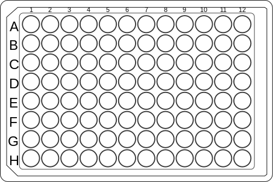

# Microplate Scanning - Basic

*By Andrew Lau and Mike Fussell*

This example script demonstrates how to set up a Zaber motorized microscope stage
to scan ANSI standard microplates with 96, 384, and 1536 wells.

## Hardware

This script is designed primarily for the
[ADR](https://www.zaber.com/products/scanning-microscope-stages/X-ADR-AE) (linear motor) and
[ASR](https://www.zaber.com/products/families/ASR) (lead-screw)
families of motorized microscope stages, but can be readily adapted to work with
any modular XY stages by Zaber Technologies.

## Dependencies

The script uses `pipenv` to manage virtual environment and dependencies:

    python3 -m pip install -U pipenv

The dependencies are listed in Pipfile.

## Configuration

Edit the following constants in the script to fit your setup before running the script:

- `SERIAL_PORT`: the serial port that your device is connected to.
For more information on how to identify the serial port,
see [Find the right serial port name](https://software.zaber.com/motion-library/docs/guides/communication/find_right_port).
- `DEVICE_NUMBER`: the order that the controller or stage is plugged into the device chain.
For example, if it is the first and only device in the chain then use the number 1.
Check the device numbering by opening [Zaber Launcher](https://software.zaber.com/zaber-launcher/download) to view the devices connected to a serial port.
- `ROW_HOME_OFFSET` and `COLUMN_HOME_OFFSET`: the offset in millimeters
from the home or zero position of both axes to the edge of the well plate.
- `PLATE_TYPE`: number of wells in the standard ANSI microwell plate.
Use the string `"96"`, `"384"` or `"1536"`.

## Running the example script

To run the script:

    cd src/microplate_scanning_basic
    pipenv install
    pipenv run python scanning.py

## Scanning Patterns

The script gives example of three different scanning patterns:

- `sequential()`: Scans each row in the same direction.  When a row is done,
advance to the next column and scan the next row in the same direction.
- `fastest()`: Scan the first row in one direction.  When the first row is done,
advance to the next column and scan the second row in the opposite direction.
The advantage over the `sequential()` method is that less time is spent back-tracking
after finishing one row.
- `random_access()`: Generate all the coordinates to visit, then shuffle them before
visiting each well in a random order, but only visiting each well once.

## Tasks to perform at each well

The scanning routine calls the function `do_task(*args)` each time it visits a microwell.
The user can edit the function to do a variety of tasks such as:

- turn on illumination or change filter cube
- call auto-focus algorithms to find the sample
- call third-party camera API to take an image
- activate pipetting robots to dispense reagents
- control other motion axes to interact with the sample (i.e. single cell picking)
