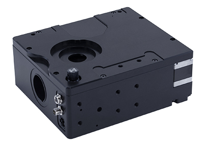

# Microscope Filter Cube

*By Stefan Martin*

This example script demonstrates how to switch between different filter cubes on the Zaber filter cube turret and Zaber microscopes equipped with it.

## Hardware

This script is intended for use with the [X-FCR06](https://www.zaber.com/products/microscopes/X-FCR) filter cube turret. This turret is integrated into the core module of Zaber microscopes.

## Dependencies

The script uses the following package:

- [Zaber Motion Library](https://software.zaber.com/motion-library/docs/tutorials/install/py)

## Configuration

Edit the following constants in the script to fit your setup before running the script:

- `SERIAL_PORT`: the serial port that your device is connected to.
For more information on how to identify the serial port,
see [Find the right serial port name](https://software.zaber.com/motion-library/docs/guides/communication/find_right_port).
- `FILTER_SETS`: dictionary of the loaded filter cubes and their pocket numbers
<https://github.com/zabertech/zaber-examples/blob/04150a1fee2df1fa43c6d06df728f61cc12c59ba/src/microscope_filter_cube/filtercube.py#L9-L10>

## Filter Cube Selection

The script gives an example of selecting a specific filter cube:

- `select_cube("BFP")`

## Multi-Dimensional Acquisition

This script can be combined with other example scripts to automate complex multi-dimensional imaging processes:

- [microplate_scanning_basic](../microplate_scanning_basic)
- [microscope_illuminator](../microscope_illuminator)
