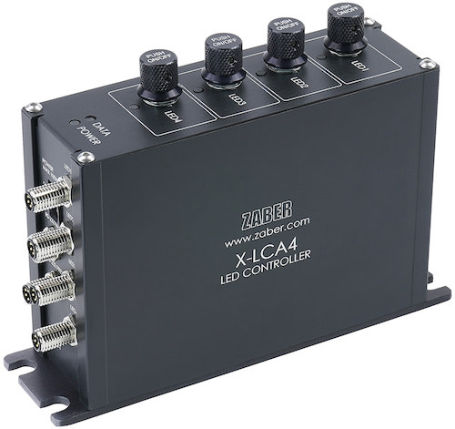

# Microscope Illuminator

*By Stefan Martin*

This example script demonstrates how to switch between different LED channels and change the illuminator intensity,
using the X-LCA4 lighting controller and MLR3 illuminaor for multi-channel imaging of flourescent targets using multiple fluorophores.

## Hardware

This script is intended for use with the following hardware:

- [X-LCA4](https://www.zaber.com/products/microscopes/X-LCA4) microscope lighting controller
- [MLR3](https://www.zaber.com/products/microscopes/MLR) transmitted illuminator
- [MLT](https://www.zaber.com/products/microscopes/MLT) epi-illuminator modules

## Dependencies

The script uses the following package:

- [Zaber Motion Library](https://software.zaber.com/motion-library/docs/tutorials/install/py)

## Configuration

Edit the following constants in the script to fit your setup before running the script:

- `SERIAL_PORT`: the serial port that your device is connected to.
For more information on how to identify the serial port,
see [Find the right serial port name](https://software.zaber.com/motion-library/docs/guides/communication/find_right_port).

## Use

- `set_intensity(Axis, percent)`: Set the intensity by a percentage or (optionally) using a particular luminous flux in watts.
- `pulse_channel(Axis, duration)`: Turn on the channel for a given time in milliseconds. Returns once the duration is over, but this wait can be removed if you'd prefer to use a signal from the camera.

## Multi-Dimensional Acquisition

This script can be combined with other example scripts to automate complex multi-dimensional imaging processes:

- [microscope_high_throughput_scanning](../microscope_high_throughput_scanning)
- [microscope_filter_cube](../microscope_filter_cube)
