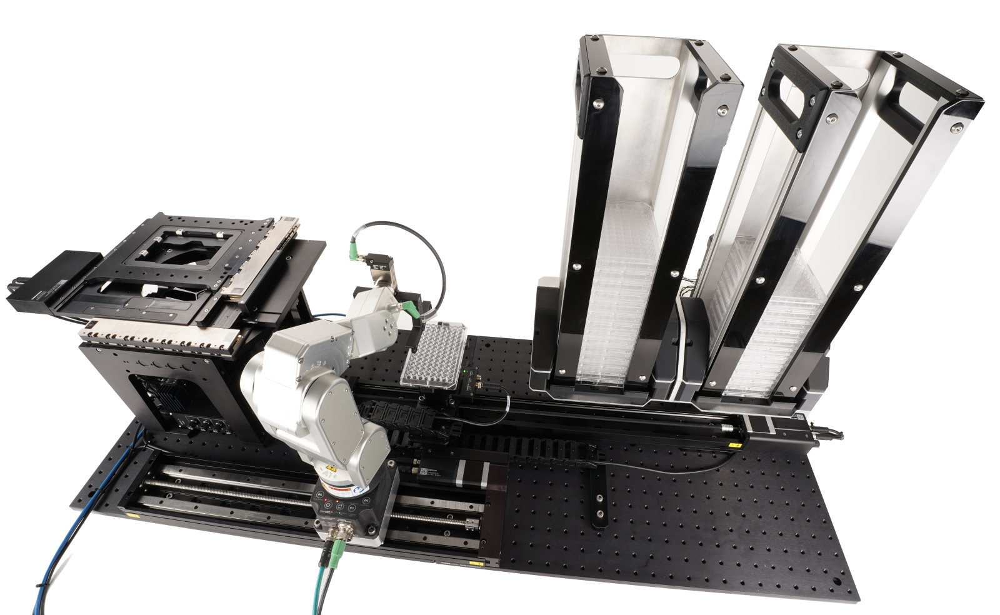

# Well Plate Loading Demo

_*By Alex Canan and Albert David*_

This example code is for the Zaber microscope [well plate loader demo](https://www.youtube.com/watch?v=l33kLwqV8tg),
which is a machine comprising a Zaber microscope with an X-ADR stage and X-LCA4 illuminator, a Mecademic robot arm
on an X-LRM stage as a range extender, and a VSR on top of an LSM stage to transport well plates from two stack
towers that use an X-SCA Process Controller to control solenoids that restrain the plate stacks.

The main demo code is in [`stacker.py`](src/plateloadingdemo/stacker.py) - the other files contain support functions, types and constants.

## Hardware Requirements

This example is very specific to the hardware assembly seen in the above video, and will need modification to work
with variations in the devices used in your own setup. An article about this demo machine will be provided
on the Zaber website under [Resources / Articles](https://www.zaber.com/articles).

## Dependencies / Software Requirements / Prerequisites

Setup:
- Install PDM if you don't already have it.
- `pdm install`
- Optional: `pdm run stream` to configure the plate scan stream, if using that option
   (selected by modifying code in [stacker.py](src/plateloadingdemo/stacker.py)).

## Configuration / Parameters

Edit [settings.py](src/plateloadingdemo/settings.py) and change the `PORT` global variable to match the
name of the serial port the Zaber stages are connected to, and change `ROBOT_ADDRESS` to the IP address
of the Mecademic robot arm.

## Running the Script

Running the program:
- `pdm run demo` to run the main demo.
