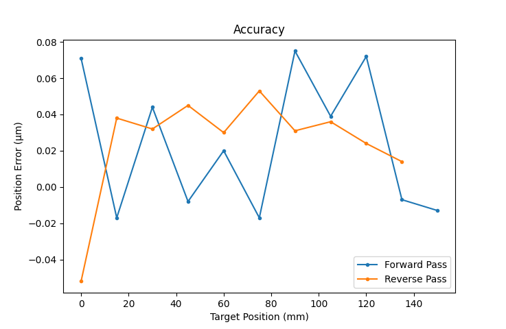

# Direct Encoder Stage Self Test

*By Nathan Paolini*

These are scripts that can be run to allow a Zaber stage with a Direct Encoder (DE) to analyze its own performance.



## Hardware Requirements

A linear or rotary DE stage.

## Dependencies / Software Requirements / Prerequisites

The script uses `pdm` to manage virtual environment and dependencies:

Instructions on how to install it can be found on the official `pdm` project page [here](https://github.com/pdm-project/pdm).

The dependencies are listed in `pyproject.toml`.

## Configuration

Edit the following constants in the script to fit your setup before running the script:

- `SERIAL_PORT`: the serial port that your device is connected to.
For more information on how to identify the serial port,
see [Find the right serial port name](https://software.zaber.com/motion-library/docs/guides/find_right_port).
- `AXIS`: the axis number to test.

## Running the Scripts

Once everything has been configured, you can set up the environment with:

```shell
cd examples/self_test_direct_encoder_stage/
pdm install
```

Then, run either the accuracy or settling-time script:

```shell
pdm run accuracy
```

```shell
pdm run settling-time
```

## Script Purpose

Zaber stages with direct encoders allow the stage to report on its own performance.

- `src/self_test_direct_encoder_stage/accuracy.py` allows a DE stage to test it's open loop accuracy or repeatability.
- `src/self_test_direct_encoder_stage/settling_time.py` allows a DE stage to determine its move-and-settle time for a variety of settings and step sizes.
