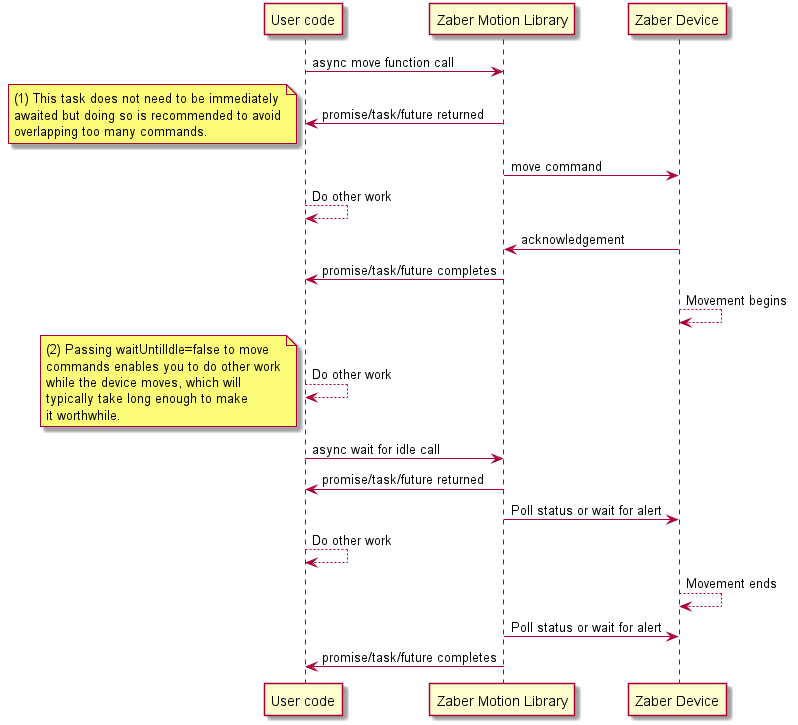
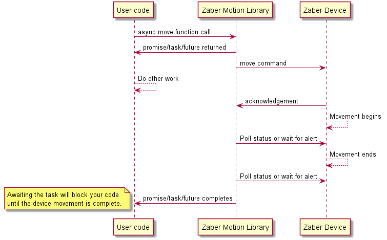

# Asynchronous use of the Zaber Motion Library

*By Soleil Lapierre*

This example demonstrates fully asynchronous use of the Zaber Motion Library in each language in which
it supports asynchronous operations.

The example is intended as a reference for advanced programmers. It's not strictly a best-practice guide;
the code discusses both good and bad usage patterns and things to consider.

Users new to the Zaber Motion Library or novice programmers should ignore this example and use the synchronous functions
found in other examples until there is a need for asynchronicity. Asynchronous programs can
be difficult to understand and debug.

The example generates a two-dimensional grid of points to visit and moves two
device axes to each point in sequence, waiting for motion to stop at each point.

Many Zaber Motion Library commands have both synchronous and asynchronous versions. For simplicity
most of our other example code uses the synchronous versions, but this example uses the asynchronous
functions as much as possible to demonstrate their use.

There are two forms of asynchrony involved in controlling Zaber motion devices:
1. Asynchronous function calls return a Promise, Task or Future to user code almost immediately,
   and that object can be awaited either immediately or later. When awaited, the object blocks user code
   execution until the original asynchronous function has completed its work. Zaber Motion Library
   asynchronous functions complete their returned Promise/Task/Future when any message(s) they send to
   a Zaber device are responded to by the device, except for movement commands (see item 2 below).

   The turnaround time for one message and response depends on the communication medium; USB and
   Ethernet connections will be fastest. RS-232 is slower, with a typically less than 10ms turnaround
   depending on message length. Some Zaber Motion Library functions exchange multiple messages with
   devices, resulting in more communication time overhead.

   By calling multiple asynchronous functions and not immediately awaiting the results, greater parallelism
   can be achieved but it is possible to overload a device's ability to parse and dispatch the commands,
   resulting in a fatal system error that requires a reset. You can typically get away with overlapping
   two or three commands in this way, and the example code demonstrates how to do this, but in general
   we recommend against it. Also, be aware that when overlapping asynchronous function calls, the order
   of execution and the order of delivery of commands to the device are not guaranteed.

2. Movement functions (both synchronous and asynchronous) by default wait until the device stops moving
   but can optionally return before the move is completed, just after receiving the device's
   acknowledgement of the command. Most of Zaber's other example programs use the default blocking behavior
   but this example demonstrates both and reveals places where CPU time is available while the device moves.

   Movement functions have a "wait until idle" parameter that controls this behavior and defaults to true.



The above timing diagram illustrates the two kinds of asynchrony in the case where you tell a movement function
not to wait for idle. Here you have the opportunity to do your own processing in three places: Before awaiting
the initial move command response (short), while the device is moving (long) and while waiting for the device
to stop (variable).



The second diagram illustrates the timing in the default case where movement functions will wait for the device to
become idle. Here you have one combined block of time in which to do parallel processing, but when you decide
to await the task your code will block for potentially a long time until the physical move is done.

In both cases you can always use `Axis.isBusy()` to check if the device is still moving without blocking for long.


The communications lag mentioned in (1) above is inherent in any messages sent to or from the device - the horizontal
arrows on the right side of the above diagrams. Note the timing diagrams above
do not show program flow control; execution can return to user code almost immediately when calling an
asynchronous function.

This example has slight variations between languages; if you're interested, it's worth looking at them all.

There are no C++, MATLAB or Octave versions of this example because the Zaber Motion Library does not support asynchronous
function calls in those languages. The best you can do in those languages is to tell the move commands not to wait for idle,
and do some other processing while the device is moving. This is, however, still the biggest opportunity for parallelism
in Zaber Motion Library usage in terms of CPU time availability.


## Hardware Requirements

This example assumes you have either a controller with two linear peripherals, or two linear devices
connected together on the same daisy chain. You can edit the constants in the example source code to set
the connection information, device address(es) and grid dimensions to work with your particular devices (the
default values may not address your devices or may produce out-of-range motion).


## Dependencies / Software Requirements / Prerequisites

Running the example requires the following software setup:
* C#: DotNet 8.0 or later, or Visual Studio 2022 v17.8.2 or later.
* Java: Maven 3.9.6 or compatible, and a Java 8 or later runtime.
* JavaScript: Node 14 or later with a compatible version of npm.
* Python: Python 3.10 with Pipenv installed.


## Running the Script

Before running the example, edit the constants in the code that define what communication port to use
and the device addresses and axis numbers for two linear axes for the program to control.
The device addresses can be the same if you have a multi-axis controller.

* C#:
  > ```
  > cd csharp
  > dotnet restore
  > dotnet run
  > ```
  (Alternatively, open the `async.csproj` file with Visual Studio 2022 and use the debugger to run the program.)
* Java:
  > ```
  > cd java
  > mvn clean compile assembly:single
  > java -jar target\async-1.0-SNAPSHOT-jar-with-dependencies.jar
  > ```
* JavaScript:
  > ```
  > cd javscript
  > npm i
  > node async.js
  > ```
* Python (Windows):
  > ```
  > cd python
  > py -3 -m pipenv install
  > py -3 -m pipenv run python async.py
  > ```
* Python (non-Windows):
  > ```
  > cd python
  > pipenv install
  > pipenv run python async.py
  > ```
