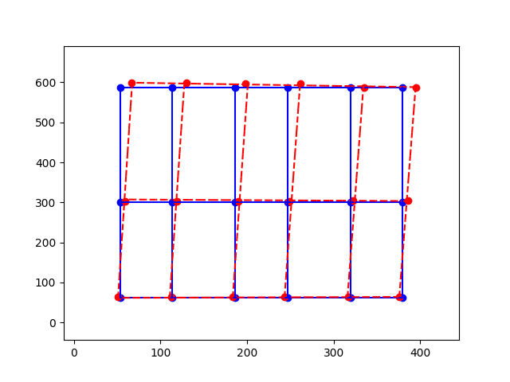

# Gantry Calibration

*By Andrew Lau*

A Cartesian gantry or XY system serving a large area often requires calibration to achieve the
accuracy required.

This is a Python example showing how to take the expected and actual coordinates of a few grid
points on the gantry, and generate a mapping from desired coordinates to calibrated coordinates.

|         Basic Bilinear           |            Biquadratic              |             Real Example              |
|:--------------------------------:|:-----------------------------------:|:-------------------------------------:|
|  |  |  |

- On the left, the basic premise is that the user commands the stage to move to the blue *expected* locations $(x_p, y_p)$, but finds that the red *actual* locations are at machine coordinates $(x_p', y_p')$. By recording the coordinates of both the blue and red dots, we can come up with a mapping function that takes the expected or raw machine coordinates (blue), and return the actual or calibrated coordinates (red) for anywhere in the area.
- The calibration code is flexible enough that it can take an arbitrary number of points and do a least-square fit to an arbitrary order of polynomial in either axis.  In the middle example, we generated points with a random offset, and fitted a 2nd order (quadratic) curve to both axis.  A quadratic curve requires a minimum of 3 points to define the function, and two-dimensional biquadratic fit requires a minimum of 3 x 3 = 9 points.  In the middle picture we supplied 5 x 5 = 25 points, so the calibration code does a least-square fit to minimize the error.
- On the right is data from a real-life example of actual measured error in a gantry system, and using the calibration code to do a linear fit (bilinear) in both axis.

## Hardware Requirements
There is no hardware requirement for this example script, as it only demonstrates the algorithm
and visualizes the results in a plot.  However, the algorithm can be adapted to be used with any
Cartesian gantry or X-Y system, such as
[Zaber Technologies Gantry Systems](https://www.zaber.com/products/xy-xyz-gantry-systems/GANTRY)

## Dependencies / Software Requirements / Prerequisites
The script uses `pipenv` to manage virtual environment and dependencies:

    python3 -m pip install -U pipenv

The dependencies are listed in Pipfile.

## Running the Script
To run the script:

    cd src/gantry_calibration
    pipenv install
    pipenv run python calibrate.py
    pipenv run python calibrate.py basic

# How it works
The script consists of the following files,
- `calibrate.py` - a script to be called on the command line, to generate random points
and demonstrates how `Calibration` class works by plotting the coordinates before and after mapping.
- `calibration.py` - contains `Calibration` class, which can be used in other programs and applications

When running `calibrate.py`, you can specify the type of interpolation to plot with the script:

| Interpolation | Order | Minimum Number of Points |
|:-------------:|:-----:|:------------------------:|
|    `basic`    |  1st  |        2 x 2 = 4         |
|  `bilinear`   |  1st  |        2 x 2 = 4         |
| `biquadratic` |  2nd  |        3 x 3 = 9         |
|   `bicubic`   |  3rd  |        4 x 4 = 16        |
|    `poly`     | m x n |    (m + 1) x (n + 1)     |

The higher order the interpolation, the more initial data points
are necessary to deterministically generate the calibration map.
`basic` demonstrates a simple bilinear interpolation with no optional parameters.
By default, `bilinear`, `biquadratic`, and `bicubic` interpolation randomly generates
the minimum number of points required to fit the interpolation chosen.
The number of randomly generated points can be overridden with
the optional parameter `[<points>]` on the command line.  For example:

    pipenv run python calibrate.py bilinear 5

This generates a 5 x 5 = 25 points grid and does a bilinear least-square fit.

When the minimum (order + 1)2 number of points is used, the interpolated grid passes
through all the points.  When more than the minimum number of points is supplied, the interpolated
grid is computed based on least-square best fit.  When less than the minimum number of points is
supplied, the algorithm does not have enough information to generate a deterministic solution.

The `poly` interpolation can be specified with any order of polynomial and any number of points,
independently for the x-axis and y-axis.

For example:

    pipenv run python calibrate.py poly 1 2 4 3

This generates a 4 x 3 = 12 pairs of expected and actual points,
and tries to do an order 1 (linear) fit for the x-axis and order 2 (quadratic) fit for the y-axis.

To see the arguments for each of the functions, run:

    pipenv run python calibrate.py -h

For a more detailed explanation of the math behind the algorithm,
please see [calibration_map.md](calibration_map.md).
