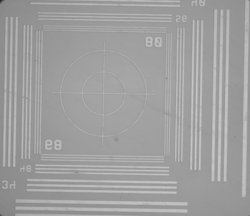

# Microscope Autofocus with Python and OpenCV

*By Skyler Olson*

To acquire a sharp image from a microscope requires that the sample be in focus. This is achieved by positioning the sample at the correct distance from the objective lens. The human eyes and brain are good at judging when an image is in focus, so a typical workflow here is to manually move the objective up and down, watching the resulting image until it looks good. However, this process is tedious, subjective, and requires a person to be present every time a slide or objective is changed.

So why not let a computer handle it? In this article, we'll show you how to leverage the power of a motorized focus axis by using [OpenCV](https://opencv.org/) to automatically discover a good position in fewer than 200 lines of Python code. This allows you to obtain sharp images from your microscope without human intervention, even as slides are moved and objectives are switched out. The example code is all written for a [Zaber Microscope](https://www.zaber.com/products/families/MVR), controlling motion with [Zaber Motion Library](https://software.zaber.com/motion-library/api/py).

## Dependencies

This example uses a Teledyne FLIR BFLY-U3-23S6M-C camera. The Spinnaker SDK, Spinnaker Python package and Simple Pyspin package are used to control the camera settings and image acquisition. While different cameras will require manufacturer specific SDKs, the basic principles used in this example can be applied to any camera that provides a Python API.

## Spinnaker SDK

Download the latest version of the Spinnaker SKD and Spinnaker Python package which are available [here](https://flir.app.boxcn.net/v/SpinnakerSDK/folder/68522911814). Install the Spinnaker SDK, but do not install the Spinnaker Python package yet. Take note of the file name of the Spinnaker Python package you downloaded. At the time of writing, the most recent version is spinnaker_python-2.7.0.128-cp38-cp38-win_amd64.zip. The "cp38" in the file name indicates that this package is compatible with Python 3.8. This is the version of Python you should install in the next step. If you are currently using µManager software to control a microscope with a Point Grey Research or Teledyne FLIR camera, please be aware that recent versions of Spinnaker are not compatible with µManager. You will need to downgrade Spinnaker prior to using µManager.

## Python

It is recommended to install the version of Python matching the version of the Spinnaker Python package you noted above.

## Python packages

After installing the recommended version of Python, install the following python packages:

- Spinnaker Python.
- Zaber Motion Library. Detailed information on how to install Zaber Motion Library for Python is available [here](https://software.zaber.com/motion-library/docs/tutorials/install/py).
- OpenCV. This package is a widely used library for computer vision. It is used here to analyze the images captured by the camera. Detailed information on how to install OpenCV for Python is available [here](https://pypi.org/project/opencv-python/).
- Simple Pyspin. This package provides simple, streamlined commands for controlling the basic operations of Teledyne FLIR cameras. Detailed information on how to install Simple Pyspin is available [here](https://github.com/klecknerlab/simple_pyspin/).

## Parameters

The example script takes four parameters:

- `start_mm`: the position, in millimeters, to start the search at.
- `end_mm`: the position, in millimeters, to end the search at.
- `step size_mm`: the size of step to take between each image capture. This must be small enough that the ideal focal position isn't completely skipped. But be careful, if this is too small, the script will take a very long time to run.
- `microscope_serial_port`: the port that the Zaber Microscope is connected to. See the [ZML guide](https://software.zaber.com/motion-library/docs/guides/find_right_port) for help finding the port name.

There are also a number of optional parameters:

- `--verbose`: The script will print out some information at each step
- `--show-images`: The script will display the image, filtered image and Laplacian image for each step to debug issues. This should not be used for more than ~10 steps, as the program can run out of memory holding on to all the images
- `--blur [int]`: Pass in a new value to blur with (default 9). The higher the blur parameter, the less noise will dominate the outcome

# Initialization

First, it will initialize the motor and camera:

https://github.com/zabertech/zaber-examples-dev/blob/9d40ddefe95cd74b78ce48693eec1841aa455c19/src/microscope_autofocus/python/autofocus.py#L69-L73

In the example code, I'll be using the following pyspin and ZML functions:

- `cam.get_array`: returns an image from the camera in a format that OpenCV can use
- `z_axis.move_absolute`: moves the Z axis of the microscope to a specified position

# The Main Loop

This is the primary control loop of the program:

https://github.com/zabertech/zaber-examples-dev/blob/9d40ddefe95cd74b78ce48693eec1841aa455c19/src/microscope_autofocus/python/autofocus.py#L80-L91

It begins by setting the best focus score to 0, and then stepping the axis forward `step_size_mm` at a time. At each step it takes an image, calculates its focus score (discussed in the next section) and then, if this is better than the previous best, saves this focus score and position. After this loop is complete, the best focus score found will be stored in `best_focus_score`, and the position it was found at in `best_focus_position`.

# The Focus Score

One of the simpler ways to quantify the focus of an image is to take the variance of the Laplacian. The code for doing so with OpenCV is shown here:

https://github.com/zabertech/zaber-examples-dev/blob/9d40ddefe95cd74b78ce48693eec1841aa455c19/src/microscope_autofocus/python/autofocus.py#L30-L34

Going line by line, this function:

- [Applies Filtering](https://docs.opencv.org/4.x/d4/d13/tutorial_py_filtering.html): A filter that removes random noise from the image, without degrading edges.
- Takes the Laplacian: An image processing technique comparable to differentiating in 2 dimensions. It will be large at points where adjacent pixels have very different intensities (such as at edges) and small when adjacent pixels have similar intensities. In general, a well focused image will have more pronounced edges, leading to sharp peaks in the Laplacian. For example, here are two images and their corresponding Laplacian:

    | Autofocus blurry image | Autofocus weak edges |
    | :---: | :---: |
    |  |  |

    *A blurry image results in weakly detected edges*

    | Autofocus focused image | Autofocus defined edges |
    | :---: | :---: |
    |  |  |

    *A more focused image, showing more defined lines in the Laplacian*

- Calculates Variance: A statistical measure of how much a series diverges from the average. If the Laplacian has well defined peaks, these result in a higher variance, as there will be many points well outside the average, thus a greater value for the variance of the Laplacian indicates a better focus.

    

    *An animation showing a series of filtered images captured by stepping through a section, the corresponding Laplacian images, and a chart showing the variance of each. The peak of the variance represents the most in-focus position.*

All of these are standard functions in OpenCV, allowing this focus score function to be written in just four lines of code.

This method is inspired by the article [Blur detection with OpenCV](https://pyimagesearch.com/2015/09/07/blur-detection-with-opencv/).

See the complete Python example script [here](python/autofocus.py).

## Troubleshooting Tips

- If you encounter an error from when running the example script, check the COMM Port number and the device order with Zaber Launcher. On a Zaber MVR microscope, the Z focus stage is the X-LDA025 stage. Zaber launcher should be closed after you have finished checking, or your script will not connect to it.
- Use an objective lens with a larger depth of field. An objective with a lower numerical aperture will increase the depth of field and help achieve a sharp focus, though increased sharpness may come at the expense of decreased signal to noise ratio on thicker samples.
- Add a fiducial marker in the desired focal plane of your sample to provide sharp, easily detected edges
- High magnification objectives are very sensitive to vibrations of the sample. If the microscope is not mounted to a stable base, vibrations will result in blurry images even if the focus position is correct. Allowing enough time for the system to settle after movements of the focus stage is also critical to achieving sharp images with high magnification objectives.
