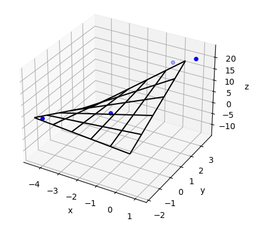
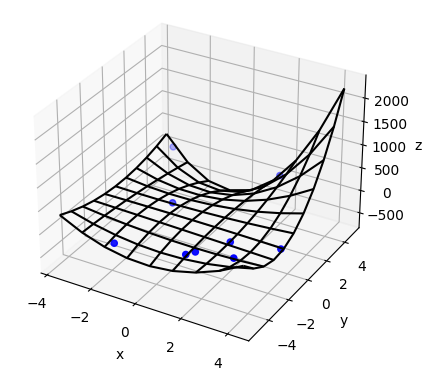
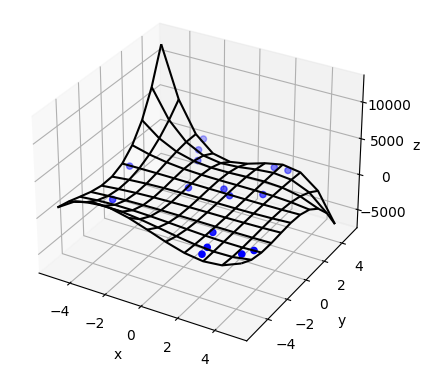

# Microscope Focus Map Algorithms

*By Mike Fussell and Andrew Lau*

A focus map gives estimated focus heights for any location on a microscope slide.

This is a Python example showing how to take a set of known good focus points
from the microscope and interpolate those into a focus map.  The script demonstrates:
- [Bilinear interpolation](https://en.wikipedia.org/wiki/Bilinear_interpolation)
- Biquadratic interpolation
- [Bicubic interpolation](https://en.wikipedia.org/wiki/Bicubic_interpolation)

|             Bilinear              |             Biquadratic             |           Bicubic           |
|:---------------------------------:|:-----------------------------------:|:---------------------------:|
|  |  |  |

The algorithm and code illustrated in this example is based on this article for finding the
[Best Fitting Plane giving a Set of Points](https://math.stackexchange.com/questions/99299/best-fitting-plane-given-a-set-of-points#answer-2306029)
using a simple least squares solution.

## Hardware Requirements
There is no hardware requirement for this example script, as it only demonstrates the algorithm
and visualizes the results in a plot.  However, the algorithm can be adapted to be used with any automated
microscope with motorized stage and focus,
such as [Zaber Technologies Automated Microscope](https://www.zaber.com/products/microscopes)

## Dependencies / Software Requirements / Prerequisites
The script uses `pipenv` to manage virtual environment and dependencies:

    python3 -m pip install -U pipenv

The dependencies are listed in Pipfile.

## Running the Script
To run the script:

    cd src/microscope_focus_map
    pipenv install
    pipenv run python focus_map.py

# How it works
You can specify the type of interpolation to plot with the script:

| Interpolation  | Order | Minimum Number of Points |
|:--------------:|:-----:|:------------------------:|
|   `bilinear`   |  1st  |        2 x 2 = 4         |
| `biquadratic`  |  2nd  |        3 x 3 = 9         |
|   `bicubic`    |  3rd  |        4 x 4 = 16        |
| higher order   |  nth  |   (n + 1)2    |

The higher order the interpolation, the more initial data points (or known good focus points)
are necessary to deterministically generate the focus map.
By default, the script randomly generates the minimum number of points required
to fit the interpolation chosen.  The number of randomly generated points can be overridden
with the optional parameter `[<points>]` on the command line.

When the minimum (order + 1)2 number of points is used, the interpolated surface passes
through all the points.  When more than the minimum number of points is supplied, the interpolated
surface is computed based on least-square best fit.  When less than the minimum number of points is
supplied, the algorithm does not have enough information to reliably generate a deterministic surface.

For a more detailed explanation of the math behind the algorithm, please see [least_square_interpolation.md](least_square_interpolation.md).
