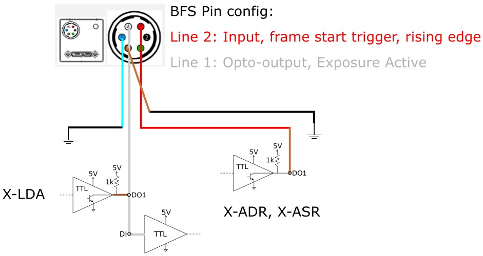
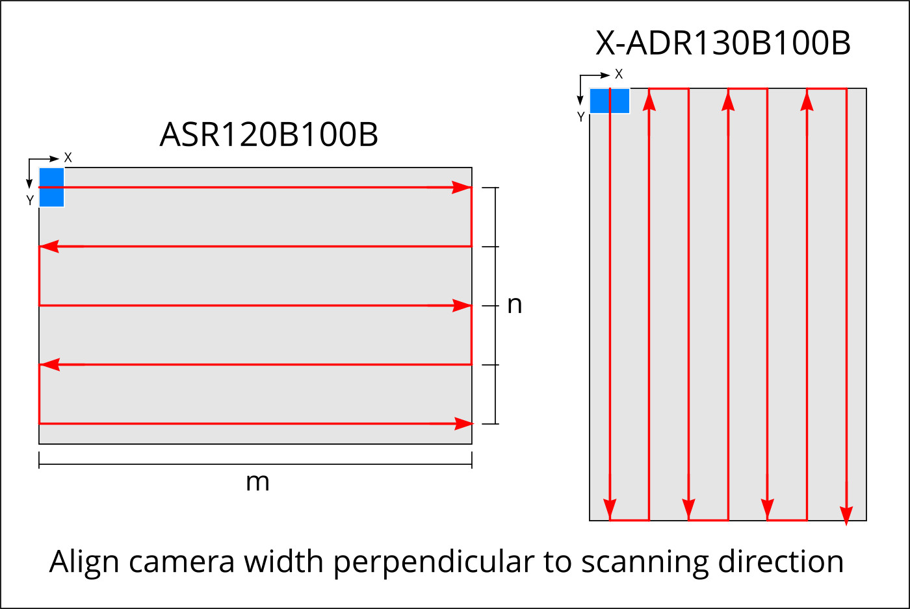

# Microplate Scanning - High Speed

*By Stefan Martin*

The optimal strategy to scan a microwellplate is one where the scanning stage never pauses and images are acquired at regular intervals along the direction of travel. This can be accomplished by using a global shutter or Time Delay Integration (TDI) camera with a sufficiently short exposure to avoid motion blur.
To reduce the scan time even further, we can avoid communications latency by using hardware triggers and buffered commands onboard the stages themselves. This allows for a substantial speedup compared to a conventional well-plate scanning strategy.

The example code is written for a [Zaber ADR](https://www.zaber.com/products/scanning-microscope-stages/X-ADR-AE), controlled via [Zaber Motion Library](https://software.zaber.com/motion-library/docs), however it can be used with any Zaber microscope XY stage.

## Dependencies

This example uses a Teledyne FLIR BFS-200S6C-M camera. The Spinview application is used to setup the camera settings and perform image acquisition. This example can be adapted to any camera that provides IO for sending and recieving triggers.

The script dependancies are defined in the ['Pipfile'](./Pipfile):

- [Zaber Motion Library](https://software.zaber.com/motion-library/docs)
- [Plotly](https://plotly.com/python/)
- [Numpy](https://numpy.org/)

## Hardware Setup

Follow these steps to setup the hardware for scanning:
1. Orient long edge of sample along the long axis of the stage
2. Rotate your camera such that the width of the sensor is perpendicular to the scan direction
3. Wire IO connections as shown below using the included IO cable (Note: DO1 on the X-LDA is used as a pullup voltage source for the open-drain camera output)
4. Setup the IO configuration for the camera in Spinview

## Configuration

- `SERIAL_PORT`: the serial port that your device is connected to.
For more information on how to identify the serial port,
see [Find the right serial port name](https://software.zaber.com/motion-library/docs/guides/find_right_port).

Enter your scan protocol in `config.py`:
<https://github.com/zabertech/zaber-examples/blob/04150a1fee2df1fa43c6d06df728f61cc12c59ba/src/microscope_high_throughput_scanning/config.py#L37-L44>
These settings define the dimension and position of your sample as well as the magnification. There are three modes:
- `TDI`: Triggering is done using onboard triggers and the TDI calculator as described in our [TDI imaging article](https://www.zaber.com/articles/tdi-imaging). This generates a snaking motion profile which will scan the sample based on the exposure required limited to the maximum stage speed.
- `area`: For conventional stop-and-shoot imaging as fast as possible. Generates a stream which will move the stage to each position and trigger the camera. Once the exposure is done, a focus adjustment is trigged
- `continuous`: For use with area cameras operating with short exposures. This method will move the stage continously, scanning the sample at the Nyquist speed and triggering the camera every time the sample has moved by the height of the sensor. Note: Consider your maximum camera FPS when setting up this mode.

Enter the details of your camera in `CAMERAS` as shown below:
<https://github.com/zabertech/zaber-examples/blob/04150a1fee2df1fa43c6d06df728f61cc12c59ba/src/microscope_high_throughput_scanning/config.py#L69-L73>

## Usage

1. Using the joystick, record the stage origin such that the edge of the camera FOV meets the edge of the scan area (blue square). Enter this as `origin`
2. Select the COM port to use to connect to your Zaber devices and choose your scan protocol and camera.
<https://github.com/zabertech/zaber-examples/blob/04150a1fee2df1fa43c6d06df728f61cc12c59ba/src/microscope_high_throughput_scanning/microscope_hts.py#L18-L21>
3. Call `generate_snake(PROTOCOL, scanning_speed)` to determine the fastest scan direction for your sample and store the motion instructions onto the stage
4. Call `execute_scan()` to move to the origin and start scanning your sample! On subsequent runs you can repeatedly call this without re-doing the setup steps above.

## Options

- `use_focus_map`: A focus map can be supplied to specify an offset of the focus position for each imaging location. The format is a (m x n) numpy array saved in `focus_map.npy` where m is the number of steppvers and n is the number of images along each scan pass. The code will take care of performing the snake along the rows of the scan.

## Extras

- `generate_focus_map` can be used to generate a randomized focus map for testing purposes. This can be replaced with your own 5-point focus interpolation.
