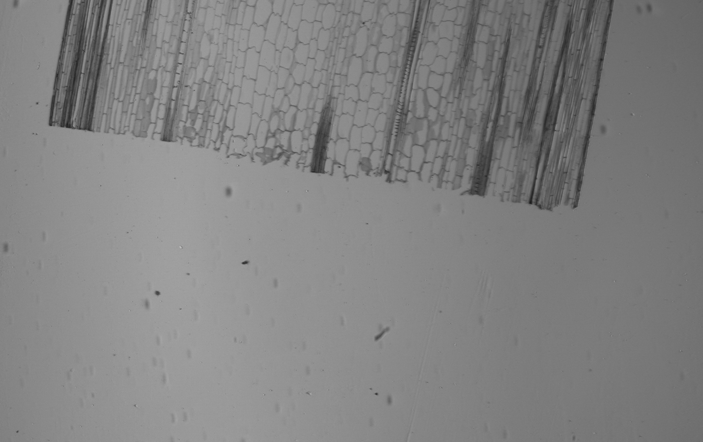

# Tiling Example with Basler Camera

*By Colby Sparks*

Often we want to capture high resolution images of samples which we cannot fit into a single camera frame. In situations like this it makes sense to create an image tileset: a collection of images which when joined form an ultra-high resolution representation of the sample in question.

This example showcases a simple technique for creating an image tileset using the [Zaber Motion Library](https://software.zaber.com/motion-library) microscope API, allowing a user to specify the top left and bottom right corners of the region they'd like to scan, and also the desired percentage of overlap between an image and its horizontal and vertical neighbours. The example also illustrates how to control a [Basler camera](https://www.baslerweb.com/en/cameras/) using the [pypylon API](https://github.com/basler/pypylon).

## Hardware Requirements
The full example code experience requires a [Zaber microscope](https://www.zaber.com/products/microscopes), Basler camera and objective. If you would like to use a different camera, you can implement your own camera wrapper class following the example contained in [`basler_camera_wrapper.py`](src/microscope_tiling_basler_camera/basler_camera_wrapper.py)

## Dependencies / Software Requirements / Prerequisites
The script uses `pdm` to manage virtual environment and dependencies:

Instructions on how to install it can be found on the official `pdm` project page [here](https://github.com/pdm-project/pdm).

The dependencies are listed in `pyproject.toml`.

## Configuration / Parameters
Edit the following constants in the script to fit your setup before running the script:

### Required Params

- `SERIAL_PORT`: the serial port that your microscope is connected to.
For more information on how to identify the serial port, see [Find the right serial port name](https://software.zaber.com/motion-library/docs/guides/find_right_port).
- `TOP_LEFT`: top left point of sample region (can be copied directly from microscope app in [Zaber Launcher](https://software.zaber.com/zaber-launcher/download))
- `BOTTOM_RIGHT`: bottom right point of sample region (also can be copied)
- `OVERLAP_H`: desired decimal percentage of horizontal overlap between neighbouring tiles
- `OVERLAP_V`: desired decimal percentage of vertical overlap between neighbouring tiles
- `PIXEL_WIDTH_MICRONS`: measurement for pixel width in microns (determined by pixel calibration)
- `PIXEL_HEIGHT_MICRONS`: measurement for pixel height in microns (determined by pixel calibration)
- `CAMERA_ROTATION_RAD`: camera rotation around z axis--axis orthogonal to plane defined by xy stage--if your camera is well-aligned, it is totally fine to leave this value at 0
__Note__: no matter the orientation of your camera and stage, it must be true that `TOP_LEFT.x` <= `BOTTOM_RIGHT.x` and `TOP_LEFT.y` >= `BOTTOM_RIGHT.y`

### Optional Params
- `SAVE_FOLDER`: the folder in which the tiled images will be saved
- `RUN_BEST_EFFORT_STITCHING`: program will try to stitch tiles together using openCV's Stitcher class (more on openCV's high level stitching API [here](https://docs.opencv.org/4.x/d8/d19/tutorial_stitcher.html))
- `RUN_NAIVE_TILING`: concatenate tiles together into single image--this should only be used with 0 horizontal
and vertical overlap

### Pixel Calibration

This example doesn't attempt to perform any sort of automated pixel calibration, so the user must also provide pixel dimensions. More information on pixel calibration can be found [here](https://ibidi.com/img/cms/support/AN/AN22_Pixel_Size.pdf).

### Focus

This example doesn't attempt to adjust focus while tiling. If your sample's height is uniform, then focus can be set manually from the basic controls or microscope app available in [Zaber Launcher](https://software.zaber.com/zaber-launcher/download).

If your sample's height is non-uniform, then it would be worth looking at the [focus map](../microscope_autofocus/) and [autofocus examples](../microscope_autofocus/) in this repository. Logic for focussing the objective could be added below the call to `AxisGroup.move_absolute` in the `capture_images` function in main:

```python
# ...
for idx_x, point in enumerate(grid_row):
    plate.move_absolute(
        Measurement(point[0], Units.LENGTH_MICROMETRES),
        Measurement(point[1], Units.LENGTH_MICROMETRES),
    )
    # focus objective here given x, y coordinates here
    # ...
```

### Running the Script
Once everything has been configured, you can run the example:

```
cd src/microscope_tiling_basler_camera/
pdm install
pdm run example
```

The script will attempt to provide useful feedback for the user, and will raise AssertionError if anything isn't configured properly.

# Tiling Images
Tiling is an important process for developing a digital representation of a sample which is too large to be viewed as a whole in a single frame. While it may be convenient to simply change to a lower-resolution objective to bring the entire sample into the field of view, a user may want to view the sample at a much higher resolution.

This example code exposes parameters for specifying the upper left and bottom right microscope stage coordinates of such a sample. Given these coordinates, it will generate a sequence of grid points based on the desired overlap between frames, then it will move along the points and capture a frame at each. It is important to have an accurate estimate of pixel size, so the code can accurately compute the real-world distance between each point to achieve the desired amount of overlap.

| Sample Top Left | Sample Bottom Right |
| :---: | :---: |
|  |  |

If we specify that we want 0.5 horizontal and vertical overlap between tiles, the tiling algorithm will generate a 3x4 grid over our sample. The following are the resulting images:

| Column 1 | Column 2 | Column 3 |
| :---: | :---: | :---: |
|  |  |  |
|  |  |  |
|  |  |  |
|  |  |  |


The algorithm for generating the path is quite simple:
- compute the size of a camera frame given the size of each pixel and camera resolution (note that the user doesn't have to specify camera resolution)
- determine horizontal and vertical step length based on frame size and overlap
- find the minimum number of steps needed to cover the area defined by `TOP_LEFT` and `BOTTOM_RIGHT`
- generate list of gridpoints, taking camera rotation into account to improve image overlap

All this logic is contained in `src/microscope_tiling_basler_camera/path_builder.py`. Additionally, the logic for controlling the Basler camera using `pypylon` API is contained in `src/microscope_tiling_basler_camera/basler_camera_wrapper.py`.

## Next Steps

The image tileset can now be joined user any technique the user desires. In this example code, we provide two functions, one which creates an openCV stitching class and attempts to stitch the images together, and one which simply concatenates the tileset together.

### Stitching

Stitching is a powerful technique for joining images, but its success depends very much on the quality of the image data being processed. We do not attempt to solve the problem of stitching in this example and instead provide this functionality of an example of how a user could integrate stitching into their own automation workflows. That said, there are some things that a user could do to improve the result of openCV's stitching pipeline:
- ensure objective, camera and sample plate are clean
- ensure consistent illumination across all tiled images
- specify 'reasonable' overlap values: between 0.1 and 0.5 overlap depending on your use case (this depends on the sample, but in general adjacent images need to share salient features for the stitching pipeline to compute homography)
- only try to stitch together a 'reasonable' number of images: a user may have success stitching together many images (>20), but our stitching example only uses 12 images, for example

If you'd like to try running the stitching pipeline, set `RUN_BEST_EFFORT_STITCHING` to true. The program will either print an error message indicating that stitching failed, or will save the stitched file as `best_effort_stitched_tiles.png`. You can also stitch together the example tileset provided in this repository by entering the following command:

```
pdm run stitching-example
```

This will load all of the images from `./img/example_tiles`, run openCV's stitcher with the default configuration and save the newly stitched file as `stitching_example.png`.

### Naive Tiling

If you would simply like to see how well your image tileset is aligned, set `RUN_NAIVE_TILING` to true and the example code will concatenate all images into a single image. The final image will be saved as `naive_tiled_image.png`
