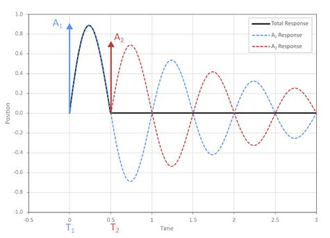

# Input Shaping for Motion Control Vibration Reduction

*By Graham Kerr and Jay Leong*

This repository contains code to complement our article [Input Shaping for Motion Control Vibration Reduction](https://www.zaber.com/articles/input-shaping-for-vibration-reduction). Input shaping algorithms described in the article are implemented in Python, along with classes allowing them to be easily used with Zaber stages via the [Zaber Motion Library](https://software.zaber.com/motion-library/api/py) API.



## Hardware Requirements

This code is designed to run on devices with [Zaber](https://www.zaber.com/) controllers. However, the underlying math could be utilized on almost any motion controller.

Notes:
- This code requires Zaber devices with firmware version 7.25 or higher.
- [measure_vibration_test.py](measure_vibration_test.py) and [shaping_comparison_test.py](shaping_comparison_test.py) scripts require a stage with a direct reading encoder to measure the resultant system vibrations.

## Dependencies

### Python

The script uses `pipenv` to manage virtual environment and dependencies:

    python3 -m pip install -U pipenv

The dependencies are listed in the [Pipfile](Pipfile).

Alternatively, Python can be installed manually. This code is designed to run with Python version 3.10 or higher.

### Python packages

The following Python packages are used in this project:

- Zaber Motion Library. Detailed installation information is available [here](https://software.zaber.com/motion-library/docs/tutorials/install/py).
- Numpy. Detailed installation information is available [here](https://pypi.org/project/numpy/).
- Matplotlib. Matplotlib is used for some of the examples involving plotting data. Detailed installation information is available [here](https://pypi.org/project/matplotlib/).

## Usage

Most of the files in this repository are designed to be imported and reused in other programs rather than being run directly.
However, most Python files contain example code at the bottom demonstrating how to properly use the classes defined in that file.
Running the Python file directly will run the example code.

Before running `measure_vibration_test.py` or `shaping_comparison_test.py`:
- Edit `COM_PORT`: the serial port that your device is connected to.
For more information on how to identify the serial port,
see [Find the right serial port name](https://software.zaber.com/motion-library/docs/guides/find_right_port).

To run the example code:

    cd src/motion_input_shaping
    pipenv install
    pipenv run python measure_vibration_test.py
    pipenv run python shaping_comparison_test.py

A brief overview of the primary files:
- [shaped_axis.py](shaped_axis.py) - Contains the ShapedAxis class, which allows the ZeroVibrationShaper class to be easily used with Zaber devices. It is recommended for most users to import this class into their code.
- [shaped_lockstep.py](shaped_lockstep.py) - Contains the ShapedLockstep class containing the same functionality as ShapedAxis but for use with a lockstep group.
- [shaping_comparison_test.py](shaping_comparison_test.py) - Contains code for testing the ShapedAxis class. The script performs moves with and without input shaping and plots the resulting performance comparison.
- [measure_vibration_test.py](measure_vibration_test.py) - Contains code for determining a system's vibration parameters. A movement is performed, plotted, and then overlaid with a theoretical damped vibration curve.

Helper files:
- [shaper_config.py](shaper_config.py) - Contains a ShaperConfig class to manage configuration and settings for the ShapedAxis or ShapedLockstep class.
- [zero_vibration_shaper.py](zero_vibration_shaper.py) - Contains the ZeroVibrationShaper class, which is a basic mathematical implementation of a zero vibration input shaping algorithm through changing deceleration. Most users won't need this unless input shaping is being implemented on a non-Zaber controller.
- [zero_vibration_stream_generator.py](zero_vibration_stream_generator.py) - Contains the implementation of shapers and generate the information required to execute a trajectory through a stream.
- [damped_vibration.py](damped_vibration.py) - Contains the DampedVibration class, which is a basic mathematical implementation of a theoretical damped vibration response curve. Most users won't need this.
- [step_response_data.py](step_response_data.py) - Contains the StepResponseData class, which is a helper class used for perfoming a move with a Zaber axis while capturing position data via the onboard scope. It is used in the other testing scripts. Most users won't need this.

### The ShapedAxis Class

Most users will want to reuse the ShapedAxis class in their code. The ShapedAxis class has all the functionality of the Zaber Motion Library [Axis](https://software.zaber.com/motion-library/api/matlab/ascii/axis) class, but adds a few extra commands for performing moves with the zero vibration input shaping algorithm. The general class usage is shown below.

Importing the class (Python):

```python
from shaped_axis import ShapedAxis
```

Initalization (Python):

```python
shaper_config = ShaperConfig(ShaperMode.DECEL)
shaped_axis_var = ShapedAxis(axis, resonant_frequency, damping_ratio, shaper_config)
```
- The axis parameter is the [Axis](https://software.zaber.com/motion-library/api/matlab/ascii/axis) class from which the ShapedAxis is derived. The ShapedAxis exposes all of the underlying methods and properties from the Axis class.
- See [here](https://software.zaber.com/motion-library/docs/tutorials/code) for a basic tutorial on how to initialize the Axis class.
- The shaper_config parameter is an instance of the ShaperConfig class that contains settings. More details on how to create a configuration can be found in [The ShaperConfig Class](#the-shaperconfig-class) section

Class Properties:
- `resonant_frequency` - Gets or sets the target resonant frequency at which the input shaping algorithm will remove vibration in Hz.
- `damping_ratio` - Gets or sets the target damping ratio at which the input shaping algorithm will remove vibration.

Class Methods:
- `move_absolute_shaped()` - Moves to an absolute position using a trajectory shaped for the target resonant frequency and damping ratio. Similar format to the [Axis.move_absolute()](https://software.zaber.com/motion-library/api/matlab/ascii/axis#_MoveAbsolute) command.
- `move_relative_shaped()` - Moves to a relative position using a trajectory shaped for the target resonant frequency and damping ratio. Similar format to the [Axis.move_relative()](https://software.zaber.com/motion-library/api/matlab/ascii/axis#_MoveRelative) command.
- `move_max_shaped()` - Moves to the max limit using a trajectory input shaped for the target resonant frequency and damping ratio. Similar format to the [Axis.move_max()](https://software.zaber.com/motion-library/api/matlab/ascii/axis#_MoveMax) command.
- `move_min_shaped()` - Moves to the min limit using a trajectory input shaped for the target resonant frequency and damping ratio. Similar format to the [Axis.move_min()](https://software.zaber.com/motion-library/api/matlab/ascii/axis#_MoveMin) command.
- `get_max_speed_limit()` - Gets the current velocity limit for which shaped moves will not exceed. Allows user specified units.
- `set_max_speed_limit()` - Sets the velocity limit for which shaped moves will not exceed. Allows user specified units.
- `reset_max_speed_limit()` - Resets the velocity limit for shaped moves to the device's existing maxspeed setting. This is the default limit and is automatically set when the class is created.
- `reset_deceleration()` - Resets the trajectory deceleration to the value that existed when the ShapedAxis class was first initialized.

__Important Notes:__
- All shaped movement commands have an optional acceleration parameter. If this parameter is not specified, the current acceleration setting will be queried from the device prior to performing each move. For maximum speed it is recommended to specify this value as it reduces communication overhead.
- Shaped movement commands using DECEL mode will adjust the [motion.decelonly](https://www.zaber.com/protocol-manual#topic_setting_motion_decelonly) setting. The `reset_deceleration()` method can be used to restore this value. No other trajectory settings are adjusted.

### The ShaperConfig Class
The ShaperConfig class manages settings for ShapedAxis or ShapedLockstep class. The only required input is the shaper_mode parameter. Depending on the mode, there may be additional settings that can be specified. These additional settings are specified as keyword arguments.

Modes:
- `ShaperMode.STREAM`: Input shaper using [streams](https://software.zaber.com/motion-library/docs/guides/streams) to send a trajectory generated by convolving impulses with trapezoidal motion. The most basic shaper is the ZV shaper which is described in [Zero Vibration Shaping](https://www.zaber.com/articles/input-shaping-for-vibration-reduction#Zero_Vibration_Shaping)
  - Settings:
    - `shaper_type`: Type of the input shaper to use. Available shaper types are defined in the ShaperType enumeration class in [zero_vibration_stream_generator.py](zero_vibration_stream_generator.py). More details on the different input shaper types can also be found in  [input_shaper_types.md](input_shaper_types.md).
      - Default value: ShaperType.ZV
    - `stream_id`: Identifier number for the stream on the device. This is necessary if multiple streams are being used on a single device in order to avoid a conflict. For example, when performing input shaping in stream mode on two separate axes on a controller, each axis will have its own stream so it is necessary to specify a different id when configuring each ShapedAxis class.
      - Default value: 1
- `ShaperMode.DECEL`: Implementation of algorithm described in [A Generic ZV Algorithm](https://www.zaber.com/articles/input-shaping-for-vibration-reduction#A_Generic_ZV_Algorithm). This method attempts to cancel the impulse from acceleration by changing the timing and magnitude of the deceleration.
  - Settings:
    - None

Initializing with stream mode and using default settings:
```python
shaper_config = ShaperConfig(ShaperMode.STREAM)
```

Initializing with stream mode and specifying optional settings:
```python
shaper_config = ShaperConfig(ShaperMode.STREAM, shaper_type=ShaperType.ZV, stream_id=1)
```

Initializing with decel mode:
```python
shaper_config = ShaperConfig(ShaperMode.DECEL)
```

#### When To Use Each Shaper Mode

##### ShaperMode.STREAM
The shapers implemented through this method can operate over any range of move distances. They independently remove vibrations during each change in acceleration so the smoothness during the move is also improved. More complex shaper types can also be used to create a shaper with a wider frequency window to make it more tolerant to errors in the system's resonant frequency. For a more detailed explanation of shaper types the benefits of each, please see [input_shaper_types.md](input_shaper_types.md).

Performing a shaped move using streams requires 3 commands to be sent in order to set the speed limit, acceleration, and end position for acceleration step as well as commands to initialize the stream before starting the move. This communication overhead will cause a delay between requesting a move and the move starting. The number of acceleration steps increases with more complex shapers resulting in longer delays.

##### ShaperMode.DECEL
This simplified method works well for short moves that are completed in a low number of vibration periods. The vibration cancellation only occurs while decelerating so the oscillation will persist during the move and only be reduced when coming to stop. This method becomes less effective with longer moves due to the errors that are accumulating in the time between acceleration and deceleration.

Performing a move only requires sending a maximum of 3 commands to the controller so communication overhead is low.

## Troubleshooting Tips

- If you encounter an error when running one of the example scripts, check the Serial Port number (ex. COM5) using Zaber Launcher.
