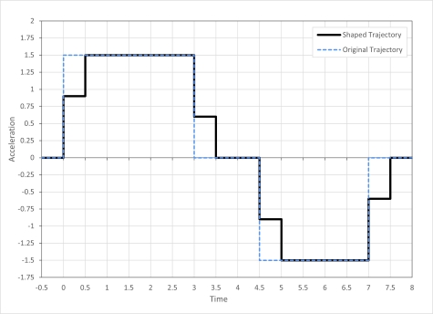
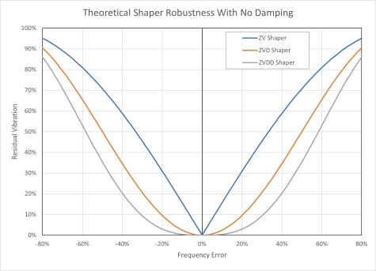

# Input Shaper Types

This article explains the different input shapers types and their benefits.

## Introduction
Different types of shapers can be used to generate the shaped trajectories that can be executed by a controller through streams. A shaper consists of a series of impulses with responses that cancel each other out when combined. These impulses are convolved with the original trajectory to produce a shaped trajectory that reduces vibration at the resonant frequency of the system. The trajectory duration is extended by the duration of the shaper so there is a move time penalty incurred with input shaping.

## The Zero Vibration Shaper
The most basic implementation of a shaper is the ZV shaper. This shaper consists of two impulses separated by half a resonant period. The resulting responses from each impulse destructively interfere with each other resulting in no residual vibration as shown in the figure below.

The decay factor, $K$, and period, $T$ are calculated using the equations below, where $\zeta$ is the damping ratio, and the equations for the impulses of a ZV shaper are shown in the table. The final impulse is at half a period which is the amount move times will be extended by after shaping.

$$
    K = e^{-\zeta\pi/\sqrt{1-\zeta^2}}
$$

$$
    T = \frac{1}{resonant frequency}
$$

**ZV Shaper Impulses**

| Impulse Time | Impulse Magnitude |
|--------------|-------------------|
| $0$          | $\frac\{1}{1+K}$  |
| $0.5T$       | $\frac\{K}{1+K}$  |

Convolving a ZV shaper with a step acceleration results in it being split into two steps spaced half a period apart as shown in the image below.

The figure below shows the shaper applied to a full trapezoidal velocity move.

## More Robust Shapers
A shaper is tuned to target a specific resonant frequency and will be less effective if the actual resonant frequency of the system deviates from the shaper frequency. More complex shaper types can be used to widen the effective frequency window. These typically have longer durations so the additional robustness comes at the expense of longer move times.

The figure below shows the theoretical effectiveness of various shapers with varying amounts of error between the actual resonant frequency and shaper frequency. The amount of residual vibration with a ZV shaper quickly increases when there is any error in the frequency while the others have a wider tolerance band.

### Zero Vibration and Derivative Shapers

A ZVD shaper widens the effective frequency window by setting the derivative of the frequency response curve at the target frequency to zero. The impulses for this shaper are shown in the table below. The final impulse is at one period which means that a move will take an additional half period compared to a ZV shaped move.

**ZVD Shaper Impulses**

| Impulse Time | Impulse Magnitude       |
|--------------|-------------------------|
| $0$          | $\frac\{1}{1+2K+K^2}$   |
| $0.5T$       | $\frac\{2K}{1+2K+K^2}$  |
| $1.0T$       | $\frac\{K^2}{1+2K+K^2}$ |

A ZVDD shaper sets the second derivative to zero to further widen the window.

**ZVDD Shaper Impulses**

| Impulse Time | Impulse Magnitude             |
|--------------|-------------------------------|
| $0$          | $\frac\{1}{1+3K+3K^2+K^3}$    |
| $0.5T$       | $\frac\{3K}{1+3K+3K^2+K^3}$   |
| $1.0T$       | $\frac\{3K^2}{1+3K+3K^2+K^3}$ |
| $1.5T$       | $\frac\{K^3}{1+3K+3K^2+K^3}$  |

In addition to the longer move times due to the increased shaper duration, each impulse increases the number of commands that need to be sent to the controller to set up the stream. This additional communication overhead will increase the delay before the start of the move.

### Summary of Shaper Types

| Shaper Type | Shaper Duration | Frequency Tolerance  for <10% Residual Vibration  (Assuming No Damping) |
|-------------|-----------------|---------------------------------------------------------------------------------|
| ZV          | $0.5T$          | $\pm6\\%$                                                                       |
| ZVD         | $1.0T$          | $\pm20\\%$                                                                      |
| ZVDD        | $1.5T$          | $\pm30\\%$                                                                      |
