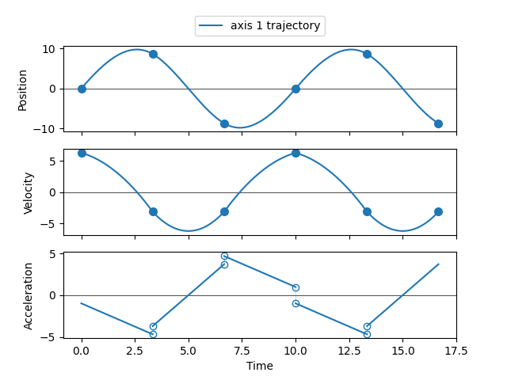
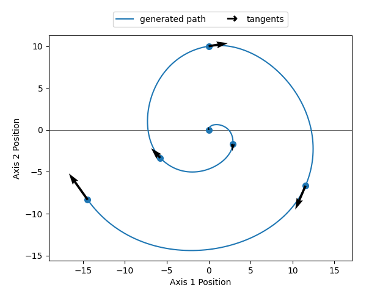

# PVT Sequence Generation

*By Jeff Homer, Firmware Team*

This repository contains code to complement our article [Motion Planning with Position-Velocity-Time](https://www.zaber.com/articles/motion-planning-with-position-velocity-time). The cubic polynomial PVT algorithm
described in the article is implemented in Python, along with helper functions to automatically
generate missing parameters, plot the generated path and trajectory, and save the results
to a CSV file that is compatible with [Zaber Launcher](https://software.zaber.com/zaber-launcher/download)'s PVT Viewer App.

## Hardware Requirements

This code can be used to generate PVT sequences that can be run on devices with [Zaber](https://www.zaber.com/) controllers.
However, the underlying math and generated trajectories could be utilized on almost any motion controller with position-velocity-time capabilities.

Notes:

- This code requires Zaber devices with firmware version 7.33 or higher.
- This code can be used to generate PVT sequence CSV files compatible with [Zaber Launcher](https://software.zaber.com/zaber-launcher/download)'s PVT Viewer App.

## Dependencies

The script uses `pipenv` to manage virtual environment and dependencies:

```shell
python3 -m pip install -U pipenv
```

The dependencies are listed in Pipfile.

## Configuration

Edit the following constants in the script [generate_pvt_sequence.py](generate_pvt_sequence.py) to fit your setup before running the script:

- `DATA_DIRECTORY`: the directory of the input file(s). By default
this points to the provided 'sample_data' directory.
- `FILENAMES`: the names of the input files to read. Instructions on
how to structure these files can be found in the docstring of [generate_pvt_sequence.py](generate_pvt_sequence.py).
- `TARGET_SPEED`: the target speed to use when generating velocities and times.
- `TARGET_ACCEL`: the target aceleration to use when generating velocities and times.
- `SHOW_PLOTS`: whether to plot the generated sequences.
- `OUTPUT_DIRECTORY`: the directory to write the generated CSV files to. Specify this as an empty string to write to the current directory, or as None to not generate the files.

## Running the Script

To run the script:

```shell
cd src/pvt_parameter_generation
pipenv install
pipenv run python generate_pvt_sequence.py
```

## Usage

To quickly generate PVT data from position, position-time, or velocity-time data, follow these steps:
1. Create a CSV file with an appropriate structure, as defined in the docstring of [generate_pvt_sequence.py](generate_pvt_sequence.py), or use one of the sample files in one of the [sample_data](sample_data/) directories:
   - [position_data](sample_data/position_data/) contains position-only sequences,
   - [position_time_data](sample_data/position_time_data/) contains position-time sequences,
   - [velocity_time_data](sample_data/velocity_time_data/) contains velocity-time sequences, and
   - [position_velocity_time_data](sample_data/position_velocity_time_data/) contains fully-defined PVT sequences.
2. Edit the configuration parameters described in [Configuration](#configuration). Most importantly, set `DATA_DIRECTORY` and `FILENAMES` to point to the input data file(s) you are generating PVT data for. If you are generating from position-only sequences, you should also make sure to specify a `TARGET_SPEED` and `TARGET_ACCEL`. The last two parameters, `SHOW_PLOTS` and `OUTPUT_DIRECTORY` can be used to control data visualization and output.
3. With the input files ready to go and the configuration parameters set, run the script as described in [Running the Script](#running-the-script). If applicable, the output files will be generated in `OUTPUT_DIRECTORY`.

The repository also contains some helper files that may be useful for extending the functionality of the script, or to use in other applications entirely. These are described briefly below, and in more detail in subsequent sections:
- [pvt.py](pvt.py) contains several classes and functions that can be used to shape and manipulate PVT sequences.
- [visualization.py](visualization.py) contains functions to plot PVT trajectories and geometric paths.

## The PVT File

The [pvt.py](pvt.py) file contains several helper classes and functions for creating and manipulating PVT sequences.

Import all the helper classes and functions in this file under the `pvt` namespace by adding the following import to your file:

```python
import pvt
```

### The `pvt.Point` Class

This is a dataclass representing a single PVT point. It is a frozen class, meaning once an instance of it is created, it can't be modified.

#### Initialization

Initialize an instance of this class by specifying a vector defining the N-D position of the point, a vector defining the N-D velocity of the point, and the absolute time of the point.

For example, initialize a 2-D point with x and y position 1 and 2, respectively, x and y velocity 3 and 4, respectively, and time 5:

```python
position = [1, 2]
velocity = [3, 4]
time = 5
point = pvt.Point(position, velocity, time)
```

#### Class Properties

The class has the following read-only properties:
- `time` - The absolute time associated with the point.
- `position` - The position vector associated with the point.
- `velocity` - The velocity vector associated with the point.
- `dim` - The dimension of the point (1-D, 2-D, ... N-D). This is automatically inferred from the size of the position vector, so does not need to be provided by the user.

### The `pvt.Segment` Class

A PVT segment ties together two sequential PVT points, generating a continuous trajectory from one point to the next.

The following image highlights the second segment in a PVT sequence with six points and five segments.


This class can be used to sample the position, velocity, or acceleration at any time between the two points.

#### Initialization

Initialize an instance of this class by specifying the start and end points that define the sequence.

For example, given some previously defined points `point4` and `point5`, initialize a segment that ties them together:

```python
segment = pvt.Segment(point4, point5)
```

#### Class Properties

The class has the following read-only properties:
- `start_point` - The point defining the start state of the segment.
- `end_point` - The point defining the end state of the segment.
- `dim` - The dimension of the segment.

#### Class Methods

The class has the following methods:
- `position(time)` - Return the position at any time between the two points.
- `velocity(time)` - Return the velocity at any time between the two points.
- `acceleration(time)` - Return the acceleration at any time between the two points.

### The `pvt.Sequence` Class

A PVT sequence ties together any number of PVT points, creating segments between each pair, and defining a continuous path that travels from the first point in the sequence to the last.

The following image shows a PVT sequence, consisting of six points.



This class can be used to sample the position, velocity, or acceleration at any time between the two points.

#### Initialization

There are several ways to initialize a PVT sequence. These are defined below.

##### 1. Specify the points directly

Initialize an instance of this class by specifying the set of points that define the sequence. Alternatively, the class can be initialized without any points, and added to later with the `append_point()` method.

For example, given some previously defined sequence of points `point1` ... `point5`, initialize a sequence that ties them together:

```python
sequence = pvt.Sequence([point1, point2, point3, point4, point5])
```

Alternatively, you can define the same sequence by initializing an empty sequence and then later adding the points sequentially:

```python
sequence = pvt.Sequence()
sequence.append_point(point1)
sequence.append_point(point2)
sequence.append_point(point3)
sequence.append_point(point4)
sequence.append_point(point5)
```

##### 2. Generate from a CSV file

Initialize an instance of this class by providing a CSV file with position data, position-time data, or position-velocity-time data, by using the static class method `pvt.Sequence.from_csv()`.

For example, generate a PVT sequence from the sample position-only data file [spiral_2d.csv](sample_data/position_data/spiral_2d.csv):

```python
sequence = pvt.Sequence.from_csv("sample_data/position_data/spiral_2d.csv")
```

##### 3. Generate from position data

Initialize an instance of this class by providing position data, by using the static class method `pvt.Sequence.generate_times_and_velocities()`.

This method works by creating a [geometric path](#the-geometricpath-class) from the provided position data, which parameterizes the curve as a function of distance. The missing velocity and time parameters are then generated by traversing this geometric path using a trapezoidal speed profile.

For example, generate a 2-D PVT sequence from some x and y position vectors:

```python
x_positions = [1, 2, 3]
y_positions = [4, 5, 6]
sequence = pvt.Sequence.generate_times_and_velocities([x_positions, y_positions])
```

##### 4. Generate from position-time or position-velocity-time data

Initialize an instance of this class by providing position-time or position-velocity-time data, by using the static class method `pvt.Sequence.generate_velocities()`.

This method works by generating velocities such that acceleration is continuous at segment transitions. The velocity at the first and last point in the sequence will be set to zero if unspecified.

For example, generate a 1-D PVT sequence from position and time data:

```python
time = [0, 1, 2]
position = [4, 5, 6]
sequence = pvt.Sequence.generate_velocities(time, position)
```

##### 5. Generate from velocity-time data

Initialize an instance of this class by providing velocity-time data, by using the static class method `pvt.Sequence.generate_positions()`.

This method works by generating velocities such that acceleration is
continuous at segment transitions. The velocity at the first and last
point in the sequence will be set to zero if unspecified.

For example, generate a 1-D PVT sequence from position and time data:

```python
time = [0, 1, 2]
velocities = [4, 5, 6]
sequence = pvt.Sequence.generate_positions(time, velocities)
```

#### Class Properties

The class has the following read-only properties:
- `points` - A copy of the list of points defining the sequence.
- `start_time` - The start time of the sequence.
- `end_time` - The end time of the sequence.
- `dim` - The dimension of the segment.

#### Class Methods

The class has the following methods:
- `append_point(point)` - Append a point at the end of the sequence.
- `position(time)` - Return the position at any time in the sequence.
- `velocity(time)` - Return the position at any time in the sequence.
- `acceleration(time)` - Return the position at any time in the sequence.
- `save_to_file(filename)` - Save the sequence to a CSV file.

### The `GeometricPath` Class

A geometric path ties together a sequence of N-D position vectors, creating a continuous positional path between them. The generated path does not contain any velocity or time information, it creates a purely positional relationship between the points.

The following image shows a geometric path consisting of six points. Note that the path contains no velocity or time information.



Under the hood, the geometric path is represented by an multi-dimensional B-spline. The generated curve is parameterized by a normalized parameterization length `u` that goes from 0, defining the first point, to 1, defining the last.

For more information about B-splines, see <https://en.wikipedia.org/wiki/B-spline>.

#### Initialization

Initialize an instance of this class by specifying an array of position sequences. Each element of the array represents a different dimension.

For example, we might define a 2-D geometric path as follows:

```python
x_positions = [1, 2, 3]
y_positions = [4, 5, 6]
path = pvt.GeometricPath([x_positions, y_positions])
```

#### Class Properties

The class has the following read-only properties:
- `length` - The length of the path, from start to finish.
- `parameterized_lengths` - The normalized lengths corresponding to each of the points used to construct the path. These range from 0, for the first point, to 1, for the final point.

#### Class Methods

- `position(u)` - The position at the given parameterization length.
- `direction(u)` - The unit vector describing the direction or tangent of the path at the given parameterization length.
- `segment_length(u0, uf)` - The arc length between some starting and some final parameterization length.

## The Visualization File

The [visualization.py](visualization.py) file contains several functions for plotting PVT sequence trajectories and paths:
- `plot_pvt_trajectory(sequence, ...)` - Plots the position, velocity, and acceleration profiles for a given PVT sequence.
- `plot_pvt_path(sequence, ...)` - Plots the 2-D or 3-D geometric path of a given PVT sequence and scaled arrows representing the velocity vector (or tangent) at each point.
- `plot_path_and_trajectory(sequence, ...)` - Combines the previous two functions and plots both the PVT trajectories and the geometric path for the given PVT sequence.

Import the functions in this file by adding the following import to your file:

```python
from visualization import plot_pvt_trajectory, plot_pvt_path, plot_path_and_trajectory
```
